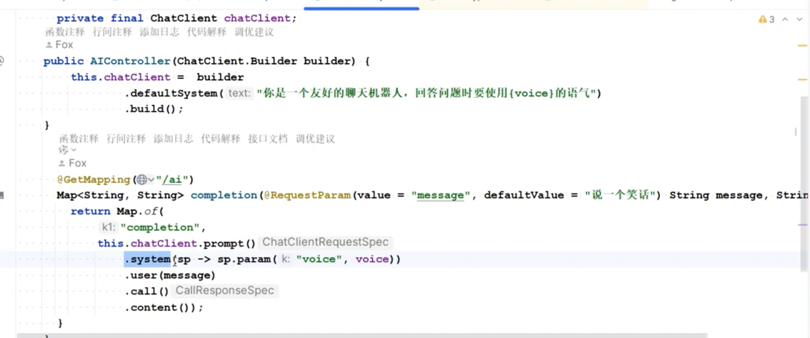
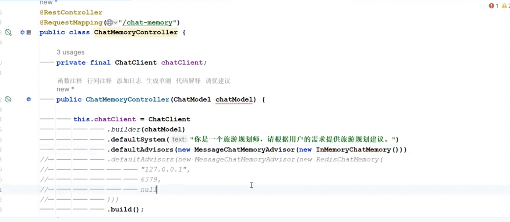
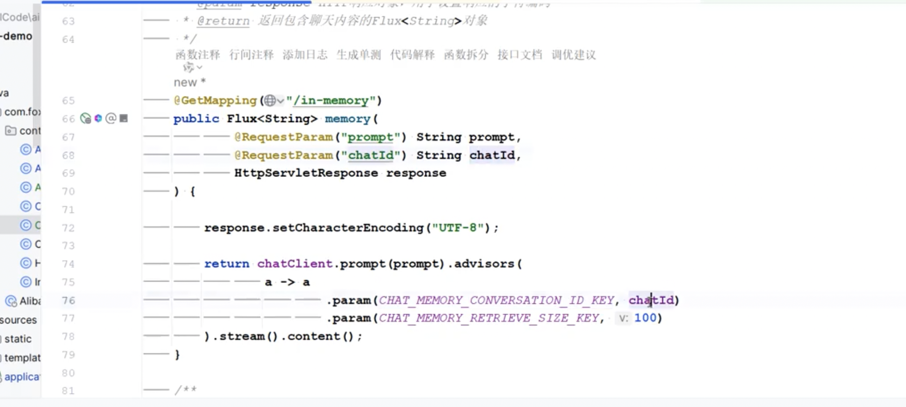
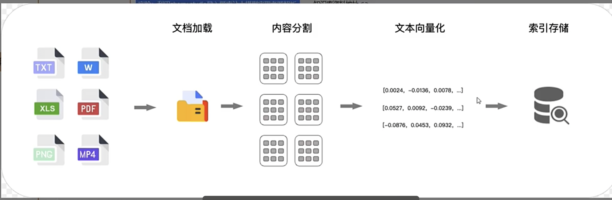
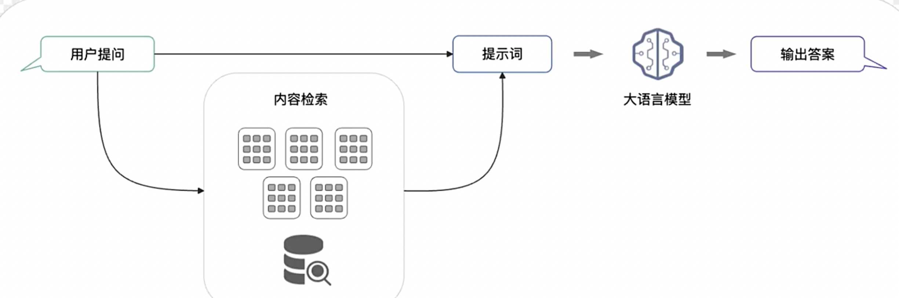

#  AI学习笔记

## 调用方式 
- Ollama方式
    - 设置ollam的pom依赖，
    - yml文件里面也要配置本地ollam地址端口，选用的模型
- 阿里dashcope百炼
    - 设置百炼的pom依赖，
    - yml文件里面，api key，选用的模型
- 类openai方式（如硅基流动）
    - 设置openai的pom依赖，
    - yml文件里面，base-url，api key，选用的模型
- 代码使用
    - 普通文本一次性输出
    - 流式输出steam

- 组件
  - 返回实体类型chatclient.entity(*.class)（返回周星驰的电影actor，成员变量name，list<string>）
  - 定制chatclient
    - 设置固定的角色
        - chatclient的builder方法里面，设置固定的角色（systemmessage，每次都带上这个，比如你是一个演员，列出参演的电影，输入input就只需要传入明星名字）
        - builder方法里面，设置固定的角色（systemmessage，可以携带变量，比如会带以{voice}语气回复），input传人
        - 
    - 多伦记忆管理
        - advier增强器 memary
        - 基与内存
          - propote提示词+chatid
          - 
        - 基与redis
          - redischatmemory
   - 对话模型chat model
    - chatmodel
    - imagemodel 文生图 通义万相
    - audio modle 文本转语音 语音转文本 sensevoice
   - 提示词
   - 结构化输出
- 阿里巴巴 ai网关 higress
- rag 检索增强生成
    - 原理：
        - 建立索引阶段（文档加载、内容分割、文本向量化、索引存储）
            - 
        - 检索与生成阶段
            - 召回于问题相关片段，对用户提问问题进行文本向量化，并与数据库中向量对比，找出相关段落
            - 检索到对应片段后，rag通过提示词模版，重写生成提示词，给到大模型，大模型进行总结回复
            

