# 第三天课程心得

## 直播课

### 聊天教程

1. 聊天宗旨：延续话题框架互动聊下去
2. 陌生阶段开场：
   1. 方法一：Hi~/轻松愉悦有趣的表情和表情包  （正常开场）
      1. 偏保守：测试女生是否在线，有没有聊天时间，是否愿意回复你（证明想聊天）
   2. 方法二：②第一眼，是心动的类型           （撩人开场）
   3. 目的：测试女生反应，反应好，按照框架和女生聊；反应不好，及时止损，换一种聊天方式
3. 朋友阶段开场：
   1. 女生回应情况：
      1. 情况一：不回消息
         1. 原因：
            1. 可能女生真的在忙
            2. 可能对你不感兴趣
         2. 处理方式：
            1. 隔2到3个小时再打一个招呼
            2. 第二天价值展示一下。
               1. 女生反应好：继续延续话题框架互动聊下去
               2. 女生反应差：抛出的话题并不是女生感兴趣的，先暂停聊天，再找机会开启话题
      2. 情况二：回应冷淡（单字，嗯）
         1. 原因：
            1. 可能是礼貌性回复(并不是对你没兴趣)
            2. 对于话题不感兴趣（觉得话题无聊不想参与）
            3. 对于你本身不感兴趣（觉得你价值低不想投入精力）
         2. 处理方式：
            1. 利用第二个框架开启话题，根据女生的兴趣爱好朋友圈，聊女生喜欢的话题
            2. 适当价值展示，让女生觉得你不是屌丝直男，值得她和你聊天
      3. 情况三：回应热情（我叫迪丽热巴）（说明对我们有兴趣）
         1. 原因：
            1. 她本身的性格就是开朗，自来熟，对人都是很热情的
            2. 只针对你一个人感兴趣，热情
         2. 处理方式：
            1. 根据她的回复然后按照八大框架一步步往下聊
   2. 注意事项：
      1. 不回消息可能女生在忙有事情，这个时候不能一直发消息，一直发让你很低价，是无所事事的男生
      2. 若多次聊天反应都不好，思考复盘，为什么？是否自己价值不够。要及时止损，别浪费时间
      3. 不要删除女生，当你提升自身吸引力，重新和女生聊
      4. 总结：我们要记住，不管你们在任何关系下，只要女生不回复你，或者回复冷淡你都要按照这种方式去处理。每一个兄弟一定要清楚的明白，因为很多兄弟以前是什么样的行为。女生不回你，你就很着急，你就患得患失，你就不断的给女生发消息，然后导致女生更加的讨厌你。女生反而觉得你这个人沉不住气，反而觉得你这个人没有价值。反而你就是一个在暴露需求感的男人，那么，很多兄弟不回复就是这样去做的，拼命的给他发消息，你以为你又做错了什么？其实你什么都没有错。你没有错，为什么要这样去做呢？他没有回复你消息，是他的问题，不是你的问题。但是，很多兄弟就是不断的给女生发消息，不断的发到最后。后女生还是不理他，甚至到最后女生把你删除给拉黑了。
4. 开启话题
   1. 通过看女生的朋友圈去开启话题：（你看到了什么，你就去开启话题，把自己的想法说出来就好）
      1. 示例：
         1. 男:哈喽
            女:嗨
            男:发现你很喜欢自拍哟
            （看到她朋友圈有自拍的时候）

            男:哈喽
            女:嗨
            男:你也喜欢旅行么，我最近去了那个青藏高原，太爱那里了
            （在她朋友圈里有旅行的时候）

            男:哈喽
            女:嗨
            男:转发妹子朋友圈的美食照，然后说，发现一枚小吃货/捕捉一枚小吃货
            （女生朋友圈有美食的时候）
      2. 别做直男，别做老实人
         1. 是否真正旅游不重要，要让女生的感觉，你也喜欢旅游。她感觉找到了同类，找到了志同道合的好朋友
         2. 那些朋友圈那个美食照那个图片直接发给女生。然后你就跟女生说，发现一枚小吃货。
   2. 通过自己的生活分享开启话题
      1. 示例：
         1. 男:哈喽
            女:嗨
            男:发自己比较帅的照片然后说，发现自己最近超喜欢自拍，难道变得越来越臭美了嘛

            男:哈喽
            女:嗨
            男:发一张美食照片然后说
            听说生蚝能美容养颜特意去吃了一下，不知道会不会变成美男子

            男:哈喽
            女:嗨
            男:发美景照，然后说这个地方太美了，好想一直待在哪里呢
      2. 注意：
         1. 享的话题是女生感兴趣的（引导女生参与）
         2. 分享的话题是高价值的不能是低价值的（别当臭屌丝）
5. 如何接女生的话？
   1. 多重脉络对话方式
      1. 示例：
         1. **单一的脉络对话会特别无聊**
         2. 概念：永远在聊着一个话题
            男:吃饭没有
            女:吃了
            男:吃的什么呢
            女:吃的鱼香肉丝
            男:谁给你做的呢，还是点的外卖
            这就是单一的脉络对话

            男：新买电动车了啊
            女：是的
            男：挺好看的，多少钱
            女：3000
            男：还可以吧价格，能带多少个人呀
            女：只能带一个
            男：带人跑的快不快
            女：......
      2. 多重脉络：
         1. 原因：真是生活：我们所说的每一件事情，它都是多方面性的，不是单方面性的
         2. 例子：生说我最近好累，那么这个时候我们的关键词是什么？累对不对？他跟我们聊这个话题就是跟累有关。那累跟什么有关呢？做的事也会累，旅游、工作、加班都会累，健身也会累，打球也会累，对不对？
         3. 关键词对话:  
            1. 通过累可以联想到很多：
            女生说 ；刚从西双版纳旅游回来，好累呀
            关键词是什么兄弟们，可以联想到什么
            男：嗯，不错嘛，看来小姐姐的生活从满了诗和远方呀，让我想起上个月从玉龙雪山玩的时候，也是累的要死，不过我感觉能看到这么美的景色一切都是值得的
            女：对呀，你也喜欢旅游呀
            男：世界那么大要去看看嘛，还有好多有趣的景点没有去过呢
            女：你都去哪些地方呀  巴拉巴拉....
            2. 根据女生说累，然后延伸到旅游这个话题，再把话题引导到自己身上，同时展示一波自己的一个价值。我不是一个宅男屌丝，我也很热爱生活，热爱旅游。我在旅游方面也很擅长，我可以带领你。其实兄弟们聊聊天，聊天聊的是什么？就是衣食住行，人情世故等等。
            3. 过关键词，联想延深话题，再把话题引导到自己，展示一波价值

### 恋爱观念

1. 错误观念:
   1. 那么，兄弟们，你们以前的观念是什么？就是从来没有人去教你们正确的谈恋爱，从来没有人教你们怎么才能让一个女生喜欢你。要知道，你们以前的观念就是爸爸妈妈身边的朋友同事给你们灌输的这种观念。就是说，你对一个女生好，你一定要对她好，你一定要去关心她，去在乎她。那么，你的同事、朋友都给你灌输的是这样的一个思维。那你面对喜欢的女孩子之后，你要给她送礼物，就要去关心她。你一定要对她非常非常好，你要给她花钱，不然人家就会觉得你很小气。所以说，你们对这个女生非常非常的好，你就对这个女生非常非常的体贴，非常非常的关心。出去约会都是请女生吃最贵的，要主动给女生买单。不要让女生花钱，等等等等
   2. **因为你认为只有这样，那么女生才会感动，她才会跟你在一起，她就会喜欢你。那么，这就是你们从小到大被灌输的一种错误思维观念**。那最后就导致成你们现在这样去追女孩子的时候。那么，我们有很多兄弟就是非常非常舍得的给女生花钱，把自己辛辛苦苦赚来的钱都花在这个女生身上，而且一点都不嫌贵，喜欢花时间花精力花金钱在这个女生身上。你们以前就是这样去对待一个女生的，就是这样去追求一个女生的。那兄弟们，你们告诉七哥，你们最后得到了什么，你们。回答我，你们最后得到了什么？
   3. 你们付出了很多很多，但是你们什么都没有得到。越是你得不到的，你就越想要，你就会对他更加更加的好。你会为他付出更多的时间，付出更多的精力，花更多的金钱在这个女生身上。那么，如果这个时候这个女生不开心了，你会想尽一切办法去哄这个女生开心。只要这个女生开心了，你就赶快道歉，对不起，我错了，我不敢了，我一定改。然后，你就会对他越来越好，越来越关心她，越来越在乎他。
   4. 那甚至很多兄弟，哪怕不是自己的错，但这个女生说你的错，你依然会认为是自己的错，然后去给女生去道歉。祈求女生的原谅，你会想尽一切办法让女生开心，你会不断的去跪舔她。那么，很多兄弟都是掏心掏肺的对女生好，没有尊严，没有底线，一味的付出，一味的在乎。因为你们觉得这个时候你们只能这样去做，才能留住女生。女生什么都没有付出，而你们却付出了很多什么。都没得到，那么这个时候你们的关系永远只是女生说了算。她说能在一起就能在一起，她说不能在一起，你马上就变成一条单身狗。那么这个时候就形成了一种恶性循环，只要女生不开心，你就会立马想方设法对她好。你会想尽一切办法去哄女生开。
   5. **如果你们的思维不去改变，你们只会越陷越深，投入越来越大，而女生越来越得不到满足。**到最后会跟你说，你给到的不是我想要的啊，然后跟你分手，甚至有时候你会干什么？你会毫无底线，没有原则和没有自己尊严去跪舔迁就他，哪怕自己不喜欢做的事情，你都会去做。因为你很在乎她，那这个时候就算你不喜欢，你也会想方设法的去迎合女生，没有尊严的去跪舔她。很多兄弟都是这样的，因为这个时候，**你把女生当成了全世界，你的世界小到全是她，而她的世界大到却没有你**
   6. 女生天天不是跟你聊天，就是跟别人聊天。天天不是跟你暧昧就是跟别人暧昧，你都不知道她到底有多少个男人在跟她聊天，到底有多少个人在跟她约会。你们还傻傻的去付出，最后很多兄弟都会被女生无情的拒绝。你是个好男人，对不起，我一直把你当哥哥，然后被女人无情的抛弃，无情的拒绝。为什么会这样？因为你们付出了很多很多，女生却什么都没有付出。**刚刚我们讲到的一个可得性，你容易得到的却越一文不值，越容易得到的越不会被珍惜。你想让一个女生跟你在一起一辈子，你也要让一个女生爱上你，离不开你，你必须得让女生付出，让她去关心你，让她去在乎你。**
   7. **因为只有这样，他才会在乎你，才不会轻易的跟你说分手，才不会轻易的去生气。因为他也付出了，他才会在乎你**。那么在这里，我也希望你明白一个道理，**你们以后不要没有尊严，没有底线，没有原则，掏心掏肺的去对一个女生好，不要委曲求全来委屈自己，不要去跪舔。不要去讨好乞求女人，因为你们这样做真的太廉价了，没有哪个女人想要廉价的东西，知道吗？没有一个人会懂得珍惜。**那么，兄弟们，你们回答七哥，你们要不要好好学习？要不要成为一个让女生为你投资付出的女人，让女人离不开你的男人，成为一个真正有价值的男人。要还是不要？
   8. 你们也要知道什么是真正的女朋友。**女朋友的定义就是女生为你付出她自己真正的关心在乎你，去给你做饭，给你洗衣服，去主动的给你打电话，主动的关心你，去照顾你。**这才是真正意义上的女朋友。
   9. 有的兄弟，不管女生有没有为你付出，有没有在乎你，不管她有没有关心你，不管她有没有主动给你打电话，有没有主动跟你聊天，你就觉得她跟你聊了一段时间，你就以为她是你女朋友了。盲目的为这个女生去付出，去讨好你们。对待爱情，总觉得她跟你待在一起。久了就会自然而然的跟你发生关系，你就觉得她跟你在一起久了之后，自然而然的能成为男女朋友。那么，**一个女人，只有她付出了宝贵的身体，那她才会从心里面去在乎你。她从心里面去认同你是她的男人，是她的依靠。但是，女生没有付出之前，你要知道。她仅仅是你认识的一个女生而已，你跟她没有任何关系，没有任何的血缘关系，那你为什么还要对她那么好呢？**
   10. 因为你们要知道，这个观念，这个思维，它是真的可以影响你一辈子的，它是无法用金钱衡量的。因为你们要知道，你们以前就是一个错误的观念。所以导致你们前几年、十几年，导致你们以前过的生活真的累的跟狗一样，很痛苦，浪费了太多太多的青春，浪费了太多太多的精力，浪费了太多太多的金钱。如果你们不去改变，你们还不去学习，你们还一直这样下去吗？你们要回答我，你们要不要认真的去学习？要不要全力以赴的去学习？要不要拼命的去学习？要不要逆袭改变，让女生来追踪你们？你们回答我。
   11. 现在最重要的一个点就是我们的一个消费观念。很多兄弟以前的消费观念是什么？给女生花很多的一个时间，花很多的一个金钱，哪怕自己在上班，你都要把时间省下来，花在这个女生身上。哪怕你自己很累，你都要花时间去陪伴女生，哪怕自己没有钱了，你都要想方设法的去给女生买衣服、鞋子、包包、化妆品。很多兄弟的消费观念就是这样的，因为你们感觉只有这样做，这个女生她才会喜欢你。但是这样自己都舍不得穿，舍不得吃，也要把钱。花给女生，**给女生消费的一个错误观念是非常错误。**
   12. 为什么？因为你把你的时间、精力、金钱花在这个女生身上，那么这个女生她会变得不断的越来越优秀，她会变得越来越好，变得越来越漂亮。因为你给她花钱了，你给她送了礼物，让他有更多的精力、更多的金钱、更多的时间去打扮自己，去提升自己。去改变自己，他变得身边有越来越多的追求者。那么你的一个情敌越来越多，而你还是一年前的那个臭屌丝，你还是永远什么都不懂，什么都不知道，还傻傻的对女生好。那你还是当初的那个臭屌。
   13. **哪怕这个女人她会离开你，女生也不会觉得你对她有多好。付出了那么多，她就会在乎你，她就会觉得跟你在一起，她只会觉得你配不上她。为什么？因为他在不断的改变，而你还是一个当初一样的一个臭屌丝的一个形象。**那这个时候，不仅仅这个女生得不到，遇见下一个女生，你还是一个样子。你还会一次一次的被伤害，一次一次的浪费你的一个青春，浪费你的金钱，浪费你的时间。那么到最后，你只能不断的错过更多的女生正因为这个观念而害了你。单身一直对女生那么好，却什么也得不。
   14. 那么兄弟们，**正确的消费观念是什么？就是你要给自己花钱。花精力，花时间投资自己，改变自己，**就好比这个女生，一个200多斤的丑女，她天天去关心你，她天天在乎你，给你报大课，他还会去给你打电话。他非常关心你，而且还愿意给你买衣服，还愿意给你花钱。那么，兄弟们，**你会因为一个两百多斤还丑的女胖子。对你那么好而喜欢他吗？**会不会因为这个200多斤的丑女对你好而喜欢这个200多斤的丑女吗？会还是不会？
   15. 那如果这个女生她花时间、精力、金钱打扮自己，去减肥，给自己买好看的衣服，买漂亮的包包，去打扮自己，去提升自己的一个工作能力，让自己变得越来越漂亮，让自己变得像范冰冰、迪丽热巴那种明星级。这女生，哪怕这个时候她对你很高冷，对你爱答不理，不去关心你，不给你花钱，你们依然会喜欢她。为什么？因为这个女生，她变成了你喜欢的样子，哪怕她对你不好，不关心你，不在乎你，你还是一样会喜欢她。**因为她真的吸引到了你，因为她把时间、精力、金钱花在了自己身上，变。变成了你喜欢的样子，哪怕这个女生她最后不给你钱，不关心你，只要她变成了你喜欢的样子，所以你还是会喜欢她。**
   16. 兄弟们，你们说说你们自己。你们以前把时间、精力、金钱投入在女生身上，对女生那么好，对自己从来都舍不得一点也不愿意去改变自己。想尽一切办法对女生好，从来不去担心他最后会不会跟你在一起，从来不去考虑你付出了以后能不能和他在一起一辈子。能不能让他喜欢你，你都不在乎他，你只会对她好，拼命的对他好，拼命的给他花钱。那么，**兄弟们，你们觉得自己辛辛苦苦赚了那么多钱，每天工作那么久，每天还要熬夜，那么辛苦，那么累，你不把钱花在自己身上，你把钱花在女生身上。你告诉我，你们说说。你们对得起自己吗？你们对得起现在的自己吗？**
   17. 你们对一个跟自己一点关系都没有的女生，对她那么好，对女生就是掏心掏肺，付出了那么多，最后什么都没有得到。那兄弟们，你们告诉我，你们要不要把钱花在自己身上？你们要不要把时间、金钱、精力花在自己身上，投资自己，让自己变得更优秀。兄弟们，你们告诉七哥是把。钱花给女生还是花在自己身。
   18. 因为只有你们脱单了，你们的父母就不会那么累。只要你成家立业了，结婚生子了，有孩子了，那么你们父母才能过得好，他就不会过的那么累。所以说，你们现在学习其实更多的是为了你们的父母，为了你们自己。你不是为了别人，知道吗？**那我希望你们要明白。只有把时间、精力、金钱花在自己身上，你们才能变得优秀，你们才会拥有更多的女生喜欢，能明白吗，兄弟们？**
   19. **真正的高质量男生，都是女生为男生花钱，都是女生追逐的，不是像你们这样乞求女生的**
   20. 如果你们现在还像以前那样舍不得对自己都舍不得，对自己都那么抠，那你们怎么可能去脱单？怎么可能让女生喜欢你？你告诉我，**你自己都不爱自己，自己都对自己舍不得。别人怎么和你在一起？别人怎么可能给你花金钱花时间？别人怎么可能跟你在一起一辈子？**所以说，我希望。你们明白一个道理，你们一定要对自己舍得，你对自己都舍不得，对自己都不愿意花时间。那么，兄弟们，你们告诉我，这种人活不活该单身，活不活该当备胎，活不活该被女人无情的抛弃，活不活该让自己更加痛苦，让父母痛苦？你们告诉我活不活？
   21. 如果他们不改变，他们现在能找到这么漂亮的女朋友吗？肯定是不能的，所以说，兄弟们抓紧时间改变自己，提升自己，让自己变得优秀，给自己人生一个交代，给关心我们的父母一个交代。就像这些师兄们一样，他们之前比我们现在还要屌丝，还要直男，还要舔狗。他们经历了一次又一次的痛苦，他们才下定决心改变自己，他们。不再被女人当备胎，当舔狗，一次次的被女人无情的抛弃和拒绝。那么，当你拥有了恋爱的能力之后，你才有机会追到自己喜欢的女生。**你没有恋爱能力，不仅这个女生。追不到，遇到下一个，下一个女生，只要她是个女人，你只能一次又一次的犯错。**
   22. 那么这些师兄们有这个决心改变？那么，他们改变之后，他们找到女朋友是怎么样的？你们可以看一下，都是非常优质的，非常漂亮的女朋友。那么，这就是一个成为高价值男人的好处。那么，你低价值，你就是一个屌丝，你只能跪舔女人，讨好女人，被女人给pass掉。那么，你当成为高价值男人之后，女生才会被你所吸引你。才能真正的找到一个高价值的女人结婚生子，给自己父母一个交代。幸福的过完这一。
   23. 这个就是你们的师兄，你们可以看一下他穿衣打扮邋里邋遢，屌丝的飞起来，对不对？头发，头发不会打理，衣服，衣服不会穿，屌丝的飞起来，在工厂里面打了七八年的工，兄弟已经30岁了，而且有一点小龅牙都不敢笑，笑起来都很难看。从小到大都不敢去说，很内向，很自卑。哎，他以前跟你们一样，甚至比你们还差很多。兄弟们可能听了一遍两遍能听懂，那他可能要听个三遍、四遍、五遍才能听懂。因为他学历不高，才小学毕。
   24. 而且，这个师兄从小到大被女生拒绝太多太多次了。我不知道你们知不知道云南那边。云南那边少数民族结婚都是很早的，很多都是十六十七岁的，都结婚了。但是这个师兄他都三十好几了，连女生是什么味道都不知道。他还是一个老处男，每逢过年回家，不管给女生买多好。多少钱的礼物花多少钱，他父母永远都是不好的脸色，说他找不到老婆，有回来有什么用？而且，亲朋好友都在背后议论他很丢人，他真的很想改变，不想再单身下去了。那这个时候，他。找到了七哥这边，那时候看起来真的很差劲，我真的有点不想收他做我的一个徒弟，不过他那时候非常的有决心，真的想特别的想去改变自己。
   25. 会拿这个师兄来出来当案例讲了，因为他给我的感觉真的是太深刻了。这个兄弟他不管再忙忙再晚也好，每天都要把作业去抄一遍，都要把这个作业去抄一遍。兄弟们，你付出的越多，得到的也就越多。他靠什么改变？靠缘分吗？靠天天窝在被窝里面看小电影吗？还是靠天上掉馅饼，他靠。到的是决心，他也相信七哥能帮他改变，我就一定能帮他改变。兄弟们，你们看一下，你们师兄改变之后是怎么样的？这个时候，我发给你们看一下。
   26. **当你懂了女生心理学，再加上技能技巧，就相当于懂了赚钱加懂女生**
   27. 这就是你们师兄改变之后的样子，**兄弟们哪有那么多自卑、内向、不自信的人？你不去改变，你哪来的自信？你告诉我，你不花时间在自己身上，从来不投资自己，不重视自己，谁又来重视你呢？这里有很多兄弟都是不自信、有点内向、有点自卑的那你又不去改变，怎么可能有自信呢？**这就是你们之间。改变之后的一个样子，师兄他有这个决心，他就能改变。这就是他改变之后找到的女朋友，非常漂亮，身材也非常的棒。而且，这个女生家里也是比较有钱的，在广州开了几家大排档，一年收租都是几十万。
   28. 那你们的师兄现在用得着去工厂去工作吗？命运都改变了他都行，这么屌丝这么丑的一个人都可以，你们不可以吗？你们不行吗？兄弟们，你们比他少了什么？比他缺了条胳膊还是少了一条腿？为什么他都能屌丝逆袭成功？如果你觉得他还是像以前一样不去改变，不去学习，你觉得他能不能追到这么漂亮的女生，人家看都不看他一眼。那这个师兄改变之后就不一样了，人生得到了改变，兄弟们，难道你天生就比人家差吗？天生不如他吗？回答我，你们比不比他差？
   29. **天底下哪有不帅的男人？只有整天给自己找各种理由各种借口的男人，天天张口闭口，我没钱，我没有时间，我很忙。这样的人，你永远改变不了，知道吗？永远只能看着别人撒狗粮秀恩爱，自己看着小电影。如果你们现在还是像之前一样的想法，你们能改变吗？**并不能，兄弟们，所以你们只能改变。才能追到你们喜欢的女人。兄弟们，你们觉得这些师兄差吗？他们差的只是方法和技巧，太晚想要彻底改变自己的一个决心，你们只是太晚遇到了我，因为我就是屌丝逆袭之人，欺。
   30. 我比你们任何人都清楚，你们处于什么阶段，需要什么样的帮助。那么，兄弟们，你们告诉七哥，你们想不想要去改变？师兄都能屌丝逆袭成功改变。那么，你们想不想去改变？相信七哥能够帮你们去改变的兄弟，打个我要改变，我要看一看有多少个兄弟不想再过着单身的生活，不想再被身边的人瞧不起了，天天。天吃着狗粮不想被喜欢的女生对你爱答不理，看都不看你一眼，抱着不改变誓不罢休的一个决心想要改变的兄弟，打个我要改

## 个人加强总结

1. 聊天：
   1. 延续话题框架互动聊下去
   2. 开场白情况处理：试探 + 不能焦虑，分析，看反应，套框架
   3. 开启话题：朋友圈 + 抛出自己日常 女生感兴趣的 展示自己价值的
   4. 接女生话：绝不能聊单一话题、多脉络延深话题
2. 恋爱观念：
   1. 没有尊严，没有底线，没有原则，掏心掏肺的去对一个女生好，不要委曲求全来委屈自己，不要去跪舔。不要去讨好乞求女人，因为你们这样做真的太廉价了，没有哪个女人想要廉价的东西，知道吗？没有一个人会懂得珍惜
   2. 要让女生给你花钱，付出，只有她投入了，关心你，照顾你，只有她付出了宝贵的身体，那她才会从心里面去在乎你。她从心里面去认同你是她的男人，是她的依靠，才不会轻易离开你
   3. 树立正确消费观念：只有把时间、精力、金钱花在自己身上，才能变得优秀，才能变得有价值，才能吸引女生；给女生花钱，只会让女生更加优秀，她只会觉得你配不上她

## 实战案例分析

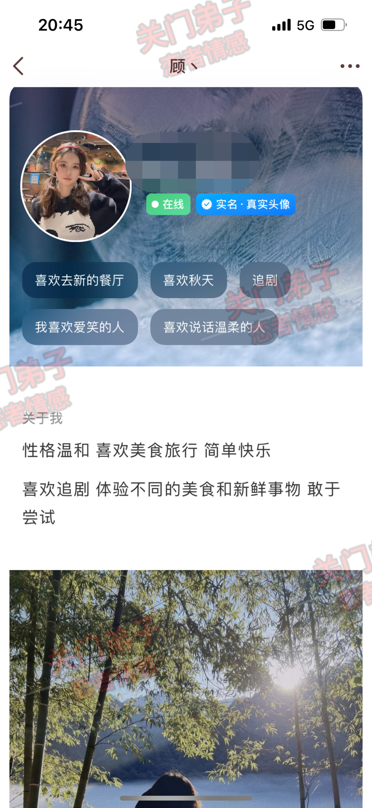

### 案例分析

1. 首先我们先女生的一个自己的资料，很多兄弟在社交软件聊天的时候，还是不懂的怎么去找话题怎么去开场，白哥说过很多次了，如果你想聊的好一点，详细一点，那么就从女生的一些资料和动态去入手
2. 这里单单一个简介就给我们提供了八个开场白了
   1. 女生喜欢去新的餐厅
   2. 喜欢秋天
   3. 喜欢追剧
   4. 喜欢爱笑的人
   5. 喜欢说话温柔的人
   6. 女生喜欢旅行，美食
   7. 女生喜欢新鲜事物
   8. 女生动态有一张她的旅游照片
   以上这8个是女生资料可以看到的已知信息，我们随意找一个就可以开场了
3. 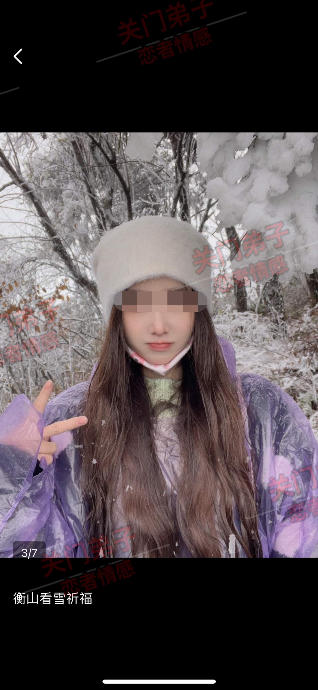
4. 比如刚刚七哥发的这个案例的女生，是不是也可以拿着她的照片去开场白呢
5. 比如：你的照片少了一点什么（记得先发女生的照片再发这句话）
6. 这是其中一个开场白，那么今天的这个案例女生你们师兄就是利用了七哥刚刚说所说的那八个资料中的开场方法，8个选一个。
7. 他选择了秋天这个话题，因为你们师兄也是个喜欢秋天的人，所以这个话题对他来说比较懂，有熟悉感
8. 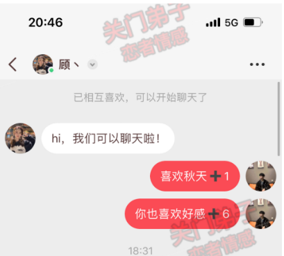
9. 注意看他的开场白：喜欢秋天＋1 （这句话的意思是我也喜欢秋天，你也喜欢秋天，大家都是一类人）
10. 那么第二句：你也喜欢好感＋6（意思就是你也喜欢秋天，我对你这个人的好感直接增加了6分）
11. 兄弟，两句话从开头就可以引起女生的一个兴趣以及拉近跟她的一个关系
12. 前面给你们讲的这些是让你们懂得聊天不要生硬照搬，要懂得利用女生的已知信息去聊，有自己的思维框架去聊，明白吧
13. **从已知信息中选择话题**
14. 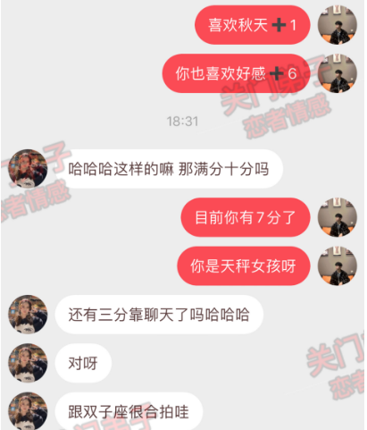
15. 当这两句话发给女生之后，女生的反应是不是非常的好 我们可以看的出来女生有回应，也有好奇心，你们看她那句反问的话：那满分是十分嘛？这里是女生回应了我们的招呼之后，然后给我们提供了话题，给你们讲清楚一点，为什么你们师兄是回复了，你目前有7分，还记得开场白的两句话吧，6＋1就是7分了，你们要记住，我们聊天是有斜街的，要清楚我们一开始说了什么话，后面应该去接着这个话题聊下去你们为什么没有话题呢，就是很多时候你们开启了话题，但是女生回复了之后你们又不懂的怎么去接女生的话了，这个时候你们可以把你们开场的那一两句话链接起来
16. 这样就不会出现聊天的时候东一句西一句没头没尾了
17. 么我们回复了女生的这个满分十分话题之后。是不是要主动去提供话题了呢
18. 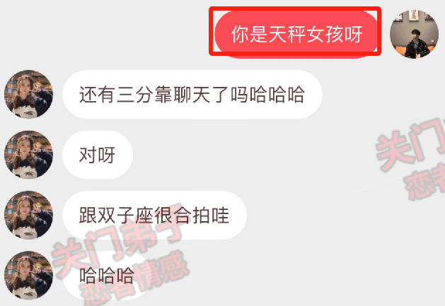
19. 你们很好奇吧，为什么会突然说你是天秤女孩呢
20. 因为这有涉及到了刚刚教你们的哪个技巧，从已知信息中选择话题，这也是从女生的资料中看到的她是个天秤女生，那么这也是个话题，我们是可以去聊的
21. 然后你们就会发现一个共同点，就是你在社交软件上和女生聊天，你只要学会**从她的一些资料动态中找到关键词作为话题跟她聊天**，你都能跟女生聊很久了，而不会出现没有话题不知道聊什么的尴尬局面了，所以这个是重点，
22. 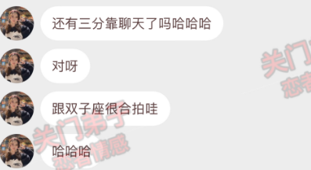
23. 继续看这个女生的一个回复，可以看到只要我们的话题提供的好，女生容易接，那么她的回复也是比较好的
24. 你们看这样的聊天是不是有来有往，会比较有趣，女生可以很轻易的接我们的话题，而我们也能更好的跟女生聊下去，这就是高情商聊天的魅力，只要你情商高，懂女生，你跟女生聊的时候你是懂得怎么引导女生聊下去的
25. 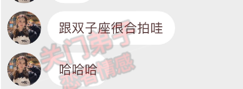
26. 注意看这两句话， 女生的兴趣就是从这里开始了，她愿意跟你聊起星座这个话题，而且还主动的说跟双子座比较合拍（你们的师兄是双子座）
27. 兄弟们，记住了，当女生兴趣上来了，我们就要去升温关系了为什么你们聊一百句聊几天都升温不了，是因为你们不懂在女生情绪反应大的时候去大胆升温，为什么你们的师兄总是能在几句话的时候就可以跟女生升温，是因为他记住了这个规律：**女生来兴趣了就马上发起进攻**
28. **和女生聊天要及时升温关系**
29. 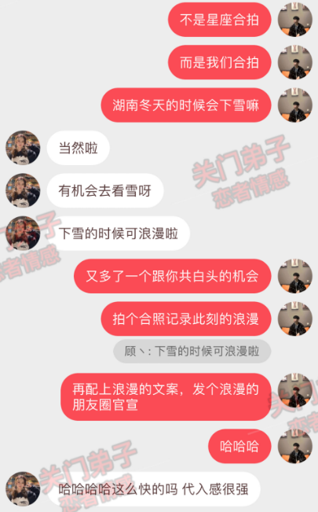
30. 1.女生说星座合拍，而我们的回应：不是我们星座合拍，而我们合拍（这里用到了推拉）
    2.突然画风一转利用一开始女生的自拍提供的已知信息聊到了雪这个话题（这里埋下伏笔开始小技巧）
    3.再用雪这个话题跟女生升温了一波＋测试（这句话的原译是：他朝若是同淋雪，此生也算共白头）意思就是两个人看个雪景有种白头到老的感觉
    4.后面说到合照，发朋友。用到制造恋爱画面感，让女生彷佛置身其中
31. 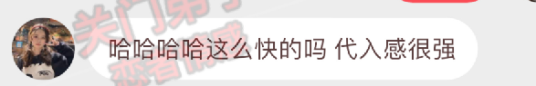
32. 女生面对的我们的测试以及升温关系并不反感，反而还说很有画面感，这里我们就已经植入了一种给到让她想要谈恋爱的画面感了
33. 一定要记住聊天的时候不**要跟女生产生对抗，我们聊天的目的是为了让彼此都愉快，而不是跟女生吵架骂街，然后影响了你和女生的情绪一整天闷闷不乐，那就有违背了我们聊天的初衷了**
34. 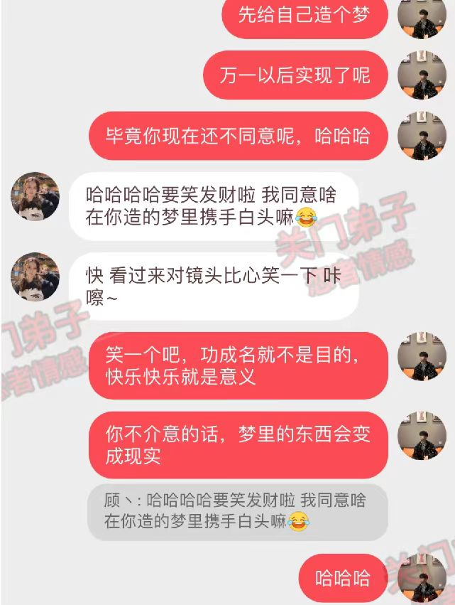
35. 前面女生说了：这么快的嘛，代入感很强，来看看你们兄弟的一个回复，他说先给自己造个梦，万一以后实现了呢，毕竟女生现在还没有答应对吧
36. 
37. 她说要笑发财了，是不是代表着此时此刻她在聊天当中得到了乐趣，在我们的话题引导下，女生从始至终都没有反感过，反而还兴致勃勃的一路跟着聊下去
38. 她的意思为什么不能是现实，这里就是女生给我们的窗口 开心的女孩子总是会比较俏皮可爱的，从女生的第二句回复你们就可以看的出来了
39. 
40. 而且这是她主动提供话题给我们
41. 既然有话题，那我们就要去接话题，而不是跳过话题。
42. **聊天的核心永远是不能东聊一句西聊一句，而是一个话题多聊，或者是一个话题聊完再到下一个话题**
43. 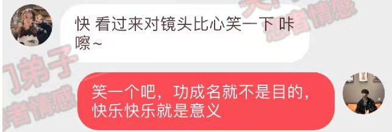
44. 那么这个时候我们就要配合女生的话题进行回应了
45. 可能你们不懂这句：笑一个吧，功成名就不是目的，快乐快乐就是意义
这句是周杰伦的歌词《稻香》这首歌，你们可以去听听
46. **和女生聊天要及时升温关系**后面慢慢的女生对你们的兴趣就下降了，然而往往你们就是死在了这个环节
47. 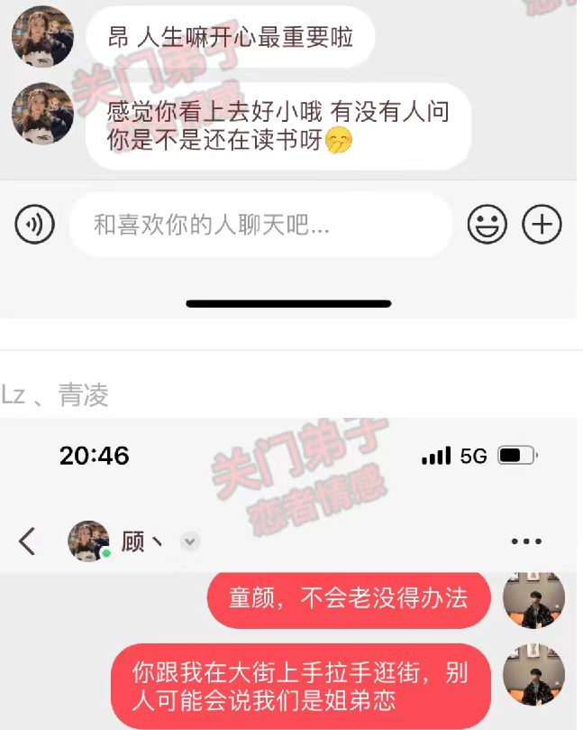
48. 其他兄弟赶紧跟上，第二个升温小技巧又来了
49. 
50. 女生的废物测试来了她说你看起来很小
51. 群里肯定也有很多兄弟长得比较童颜的，那么你们以后遇到了这样的问题之后，可以跟你们师兄一样，顺着女生的话题直接去升温
52. 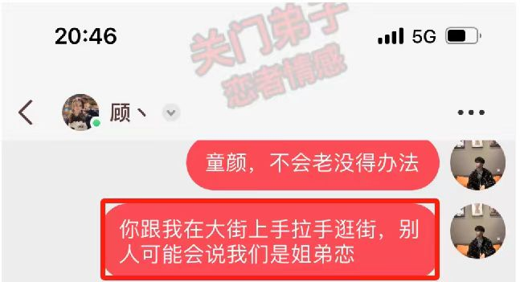
53. 这一句话不但化解了女生对你的测试，还顺带这给她描述一下了两个人以后在一起手拉手逛街的那种感觉
54. 你们要记住有时候女生的测试不一定是坏事，反而是好事，就看你怎么把她说的话接住
55. 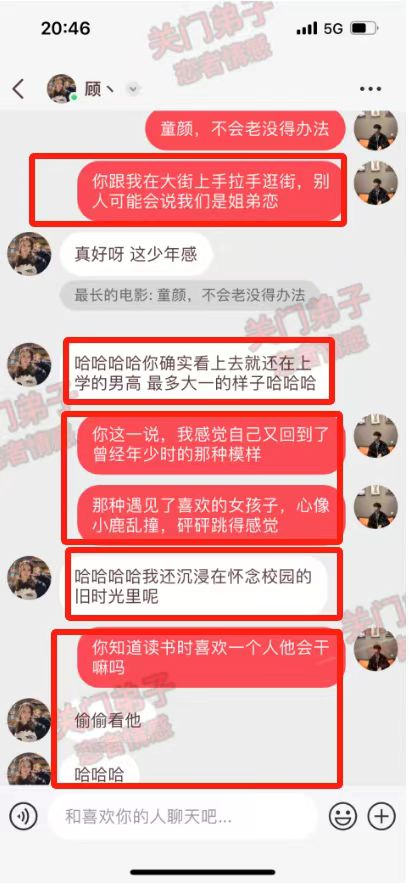
56. 
57. 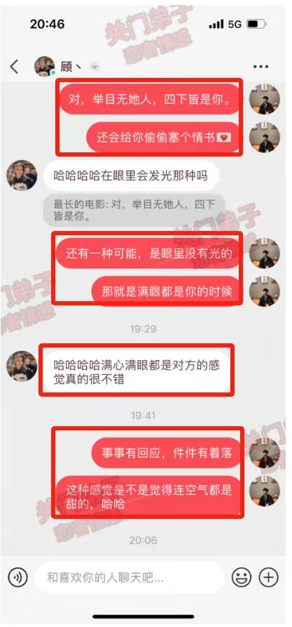
58. 这两张图用了什么技巧。  
    1. 借用女生说的小这个关键词（聊起了过往）
    2. 接着这个话题描述了年少时青春懵懂的恋爱（暗示女生）
    3. 延申话题到读书时一些乐趣（作为话题的引子去延申，也是一个伏笔）
    4. 聊到了读书时传情书的乐趣，以及那种暗恋喜欢一个人的滋味和心情（恋爱画面感植入）
    5. 全程不聊废话，只聊核心，目的就是（不断的升温关系）
59. 兄弟们，升温完关系之后又要干什么了之前七哥说过了，**一定要和女生聊感情方面的话题，知道不，这才是最重要的一个环节，聊的好决定了你们之后加微信以及邀约。**
60. 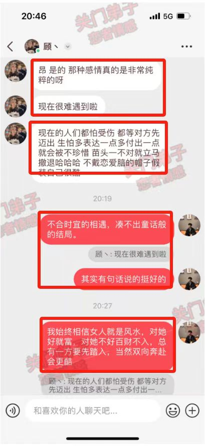
61. 经典语录分享
    1. 不合时宜的相遇，凑不出童话般的结局。
    2. 好的女人就是风水，对她好就富，不好的女人百财不入!
62. 重点是聊到了彼此的恋爱观，而且双方的观点非常的相似，那么这个时候你在女生的内心当中印象是很加分的
63. 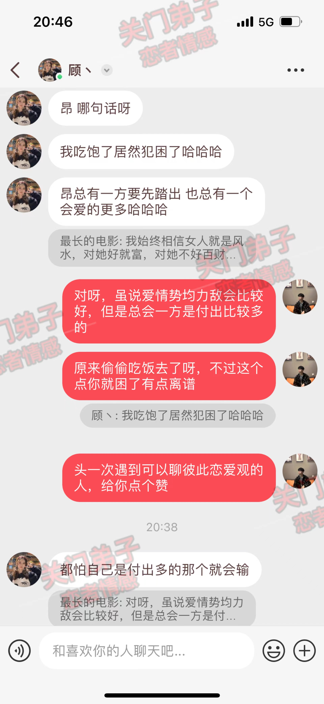
64. 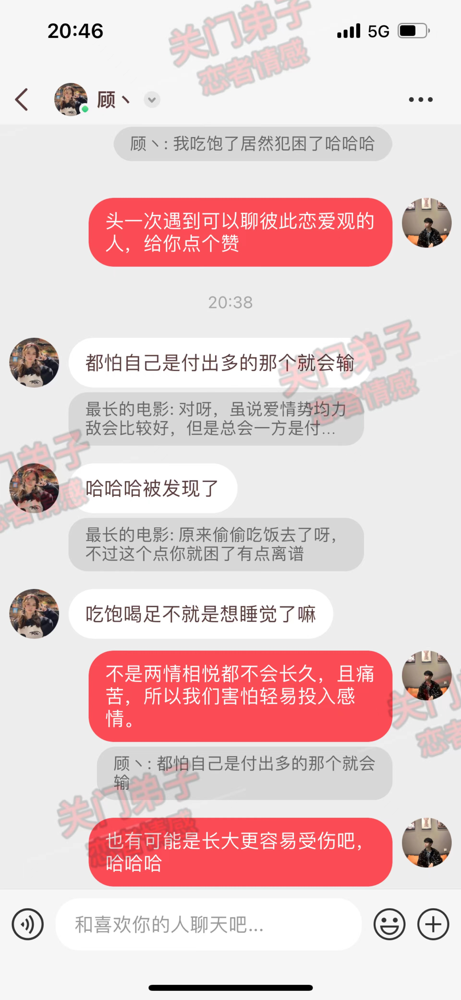
65. 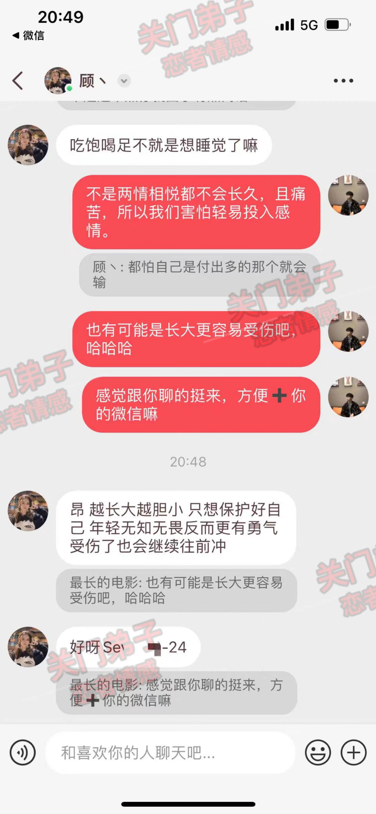
66. 后面就是合理化添加女生的微信，但是一定不要唐突贸然去要微信，你们看你们师兄聊到那么深的地步了，他还是中间聊了一些话题之后再去要女生的一个微信
67. 千万要记住，玩社交软件既是练手也是添加女生的微信增加你的筹码，不要天天的抱着一个女生去聊天，这样是没有意义的哈

#### 案例总结

1. 从已知信息中选择话题（拉近关系、制造你懂她、你俩很合拍）
2. 女生来兴趣了就马上发起进攻（去升温）
3. 和女生聊天要及时升温关系（制造恋爱画面感、）
4. 要跟女生产生对抗，我们聊天的目的是为了让彼此都愉快，而不是跟女生吵架骂街，然后影响了你和女生的情绪一整天闷闷不乐，那就有违背了我们聊天的初衷了
5. 聊天天的核心永远是不能东聊一句西聊一句，而是一个话题多聊，或者是一个话题聊完再到下一个话题
6. 聊天目的是为了邀约：一定要和女生聊感情方面的话题，好决定了你们之后加微信以及邀约
