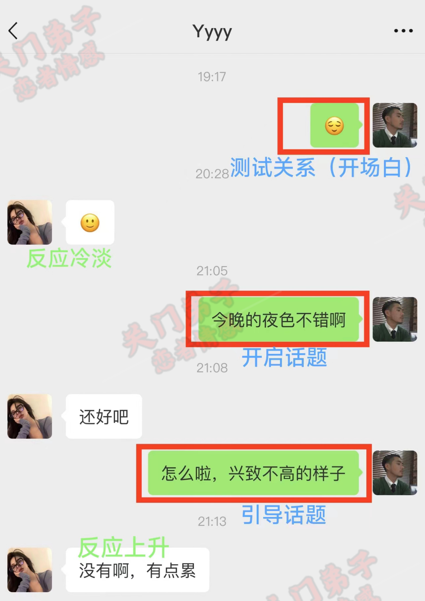
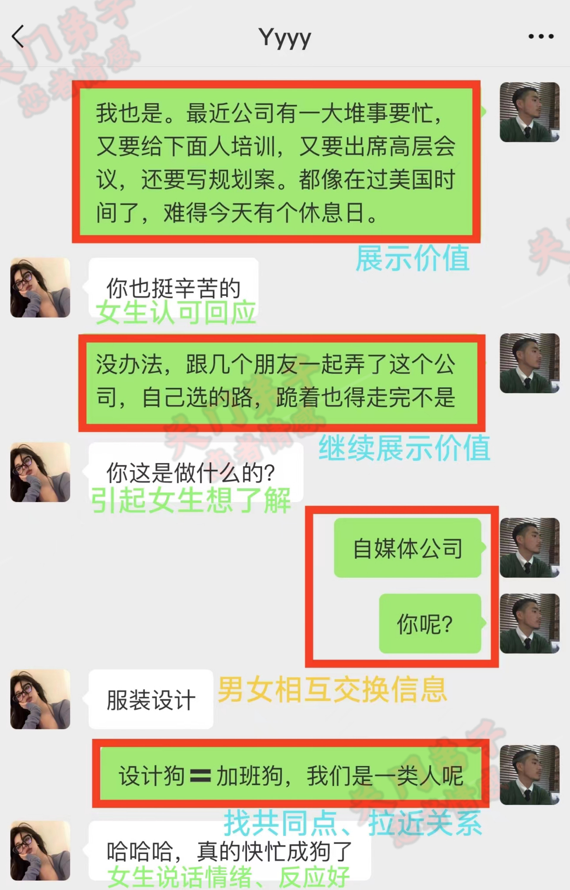
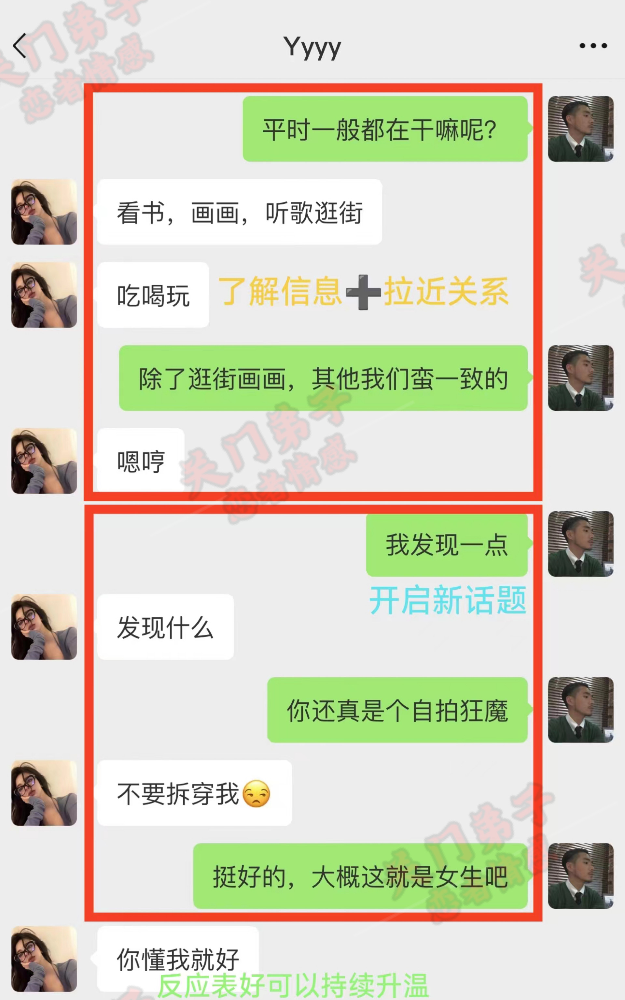
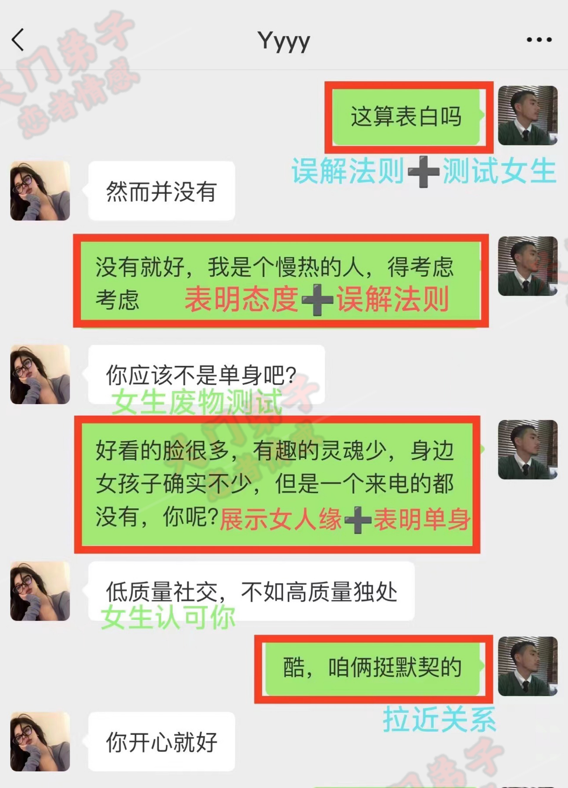
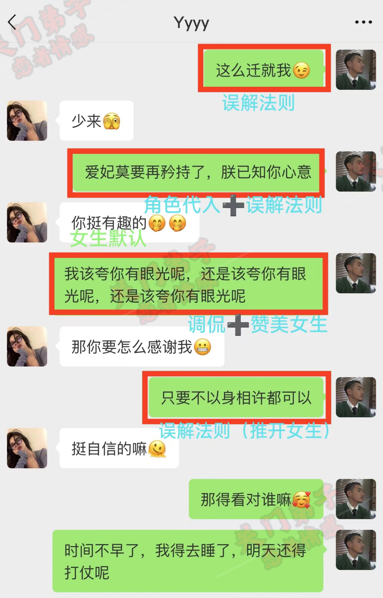
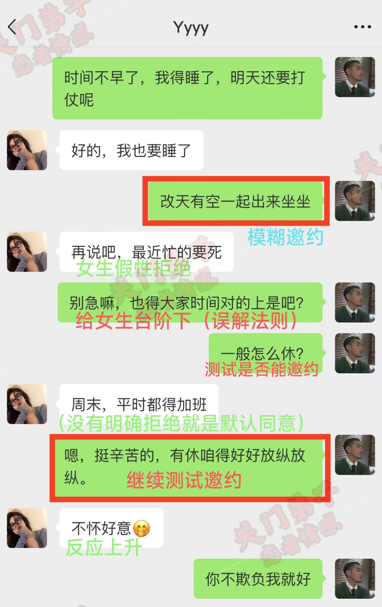
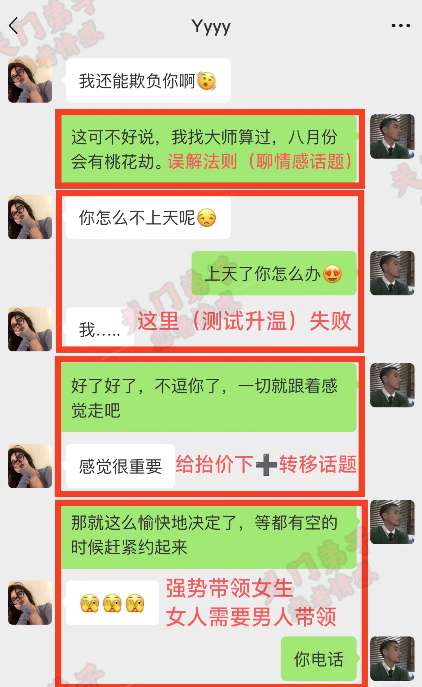
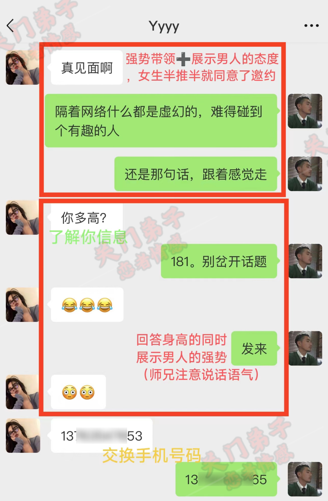
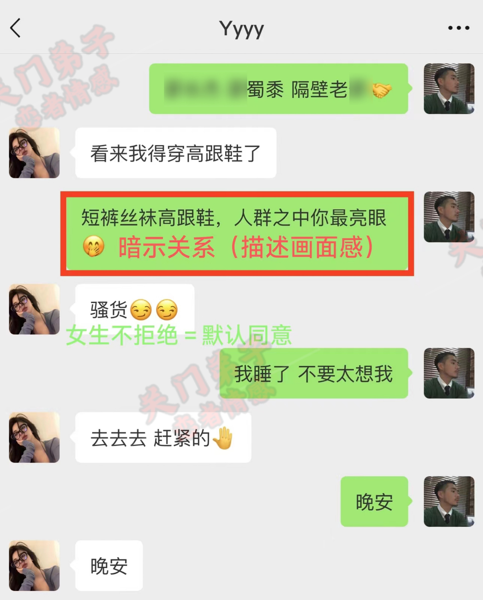

# 第二天课程笔记

## 真正意义上的女朋友

1. 真正意义上的女朋友就是**她会主动关心你，主动问候你，主动体贴你。有你不开心的时候，她会主动关心你**，而不是像在网络上叫老公叫老婆，然后一味的索取你的一个价值
2. 当一个女生没有完全跟你发生关系之前，这都算不上根本意义上的女朋友。因为女朋友的话，她肯定会主动为你付出，主动关心你，而不是一味的都是男生的为女生付出。然而，很多兄弟没有学习之前，每天。跟女生聊，在微信上叫人家老公老婆叫的非常亲切，但是呢，这些事情从来都没有做过。你告诉我，一个女生从来都没有跟你发生过关系，怎么才算的上真正意义上的女朋友呢？
3. 还有一些兄弟以为女朋友就是用来疼爱的，我们作为男生，那就要去疼爱女生，对不对？其实这样的想法就是错误的。我们作为男生一定要有我们自己的一种想法，一种原则，并不是说女生觉得我们错了，那我们就真的错了。**我们要坚持自己的原则，我们没有错就没有错。假如说你一旦踏出这一步，什么错你都承认，那么你以后想跟他去相处都是非常难的**

## 恋爱的心法

#### 社交直觉

1. 概念：社交直觉就是**让你真正拥有的一个技能去懂女生的行为**，知道女生去跟你聊的时候怎样去聊。当她跟你聊天的过程当中，她。他的行为也好，他跟你说的话也好，让你真正的懂得去判断他到底对你有没有兴趣，让你真正的明白他到底是一个怎么样的人，他到底有没有对你有好感
2. 社交直觉就是人与人之间的相处，社交直觉提高的人就可以马上的去**捕捉到女人的意图，根据女生的一个意图去聊天。说白一点就是掌握整个聊天的方向**，让你真正的懂得女生到底该怎么。怎么去聊，因为有一句话叫什么知己知彼，百战不殆。当你知道女生的行为意图之后呢，对吧，你都可以快速的吸引到自己喜欢的女孩子
3. ASD也就是反荡妇机制（真假ASD）
   1. 真ASD：**果断拒绝**；比如说你邀请女生去做一件事，她非常果断干脆的拒绝了你。你让女生给你发照片，她果断拒绝。你问女生年龄，她不说。通常遇到这种情况是你对女生的吸引不足，要回到吸引那一步，或者改头换面，过段时间提升自己吸引后再聊。
   2. 假ASD：**委婉拒绝，比如说你邀请女生去做一件事，她拒绝了你，但解释特别合理**。  
    在比如
    你让女生给你发照片，
    她说，不好吧，还不熟。
    你问女生年龄，她说，才刚认识，不太好。
    比如你去约她，她说最近工作好忙呀，天天加班，累死了，等有空的时候吧，不好意思呀
    比如 你去拉她的手，她低头然后放开你的手说，这里好多人呢
   3. 假性拒绝破解：
      1. 方法：**用到一个合理化的理由，是女生要的就是这种台阶跟理由，还有借口。**
         1. 假性拒绝，我们会用到一个合理化的理由。比如说，你让女生发照片给你，那么他的回答说不好，还不熟。那么这个时候，你只要给到女生的感觉，我们熟了之后，那她就会给你发照片，对不对？那你这个时候你就可以给他找一个借口，你可以跟他说，没关系，等我5分钟，我去捡点柴火，把你煮熟之后，你再发给我，我看你看，这个就叫做合理化的理由，就是说给到女生的感觉我们已经很熟啦，然后你过了五分钟之后。你就给女生说，我已经把你走熟了，你可以发照片给我了对不对？那么这个时候，女生发照片给你，那她就不是一个随便的人，知道吗？因为你们的关系已经熟了，哪怕你这个时候跟他发开玩笑的方式去说，但是女生要的就是这种台阶跟理由，还有借口。
         2. 再比如，你想约女生去你家，你不能直接跟女生说来我家睡一晚，我想跟你床上啪啪啪。**你这样去说，女生肯定会拒绝你。抗拒你，哪怕她也想去你家睡觉，他也会下意识的拒绝你。因为他一旦答应了你，他就会觉得自己像个荡妇**。反过来，你也会觉得它就像一个荡妇，你也会慢慢的看不上它。但是，你跟他说，我家有一只可爱的小猫，你过来，我给你撸撸猫，来我家看这个猫翻跟头，对不对？特别的幽默，这样的去说，那这个时候，女生就会跟着你去你家看这个猫翻跟头，哪怕她心里知道你会。在家里面做出一些羞羞的事情，但是他就是愿意，为什么呢？因为至少你给到他的感觉就是，他跟你去你家，只是为了看猫猫翻跟头而已。哪怕你们家没有猫，也没有关。
         3. **因为你至少给到女生的感觉，你是在骗她的对不对？那么，就算哪怕最后跟你发生了关系，他也不用负这个责任。他也不会觉得自己是一个荡妇，你也不会觉得她就是一个荡妇。因为这是你的责任，你去忽悠她所得到的。那么，当一个女生对你有兴趣的时候，你去忽悠她，她会非常的配合你。所以，这个叫做合理化的推诱，去破解女生的一个假性拒绝**。那兄弟们，你们回想一下，你们以前有没有错过女生对你有兴趣的时候，象征性的拒绝你，然后你就。认为是真的在拒绝你，是不是有很多兄弟都错过了跟女生在一起的机会？

#### 恋爱马太效应

1. **就是你越强，你就越有魅力，你越弱，你就会。让女生觉得你一文不值，你越有想法，越有主见，有原则，有底线，有尊严。她觉得你越有价值**，
2. **反之，你越没有想法，什么都顺着他，什么都听他的，就没有一点原则。为了他，什么都可以做，没有底线，甚至是没有尊严，对不对？他反而觉得你是一个没有价值的人，** 那么恋爱中的马太效应，人善被人欺，马善被人骑。就是说难听一点，就好比你是一匹温顺的马，就很容易让他人骑到，对不对？那你就是这匹马。就不是一匹好马，很容易被人征服。但是呢，当这匹马很抗拒你坐上来的时候，很不听话。
3. 抗拒到把你摔下来，对不对？你反而觉得这是一匹好马，那么你会更加想要的去征服它，**也会更有强烈的欲望去征服这匹马。你反而觉得这匹马会更加的吸引你**。那么同样的人也是一样，如果一个人他很软弱，就是什么都顺着你。举个例子，比如说你身边的同事，你饿了。他就给你买吃的，你渴了他就给你买喝的，你肩膀酸了，他就给你揉一揉，一揉对不对？那么，你说想倒垃圾，他也帮你倒一倒。然后，另外一个人他很高冷，不会顺着你，那你就会觉得哪个更有价值呢？兄弟们回答。七哥，哪一个更有价值？是总是帮你买东西和按摩的那个人有价值，还是那个高能的人更有价值了?
4. 大部分都会觉得那个高冷的人更有价值。**你越弱，他就越觉得你没有价值，你越强，你越有主见、有想法、有原则、有底线、有尊严，他就会觉得有价值**。那么，所以这就叫做恋爱中的马太效应。**很多兄弟以前就是什么都顺着女生，哪怕自己有想法都不敢说，就不断的去迁就。不断的去讨好，不断的去迎合女生。**很多兄弟都会好奇，**渣男对女生不怎么好，为什么那个女生就会喜欢呢？甚至女生还会给他买礼物。女生更加喜欢高价值的男人，有挑战性的男人跟她在一起呢，而不是那种百依百顺。她会觉得一点挑战性都没有，**你们去讨好去跪舔，然后还一脸懵逼，为什么这个女生更加不喜欢我？就会出现这样的情？
5. 并不是说让你们对女生不好。你做什么事情你都要有自己的态度，要有自己的尊严，要有自己的主见，还有自己的底线。那么，这个就叫做恋爱中的马太效应。有些事情呢，**一定触碰到了你的一个底线，你一定要生气，一定要有脾气。这就是你要做你自己，知道吗？这就是要做自己，就这么简单。**这就是恋爱中的马太效应
6. 总结：恋爱中的马太效应
你越强，你就越有吸引力  
你越弱，你就越会让女生觉得你一文不值，  
你越有想法，有主见，有原则，有底线，有尊严，她越觉得你有价值  
你越没想法，什么都顺着她。什么都听她的。做事没有原则，为了她什么都可以做，没有底线，甚至没有尊严 她越觉得你没有价值。  

## 恋爱邀约案例

1. 聊天目的是为了邀约
2. 要有社交直觉，知道什么时候真假性拒绝，刚开始要要试探测试关系，通过女生回复反应，了解判断她，进行下一步操作（如开场白女方回应冷淡，就可以给到情绪价值，询问，让女生知道你懂她）
3. 坚持自己框架，话题-引导话题-展示价值-气氛融洽-强势邀约
4. 要展现自己价值，不缺女人，不要暴露需求感，一定要有价值，才能吸引到她，才能为下面做铺垫
5. 话题升温失败后，不要慌，给台阶+转移话题（可以圆回来）
6. 在聊天气氛不错下，直接展示男人强势一面，强势引领她，邀约出来（恋爱马太效应，你越是想法，有主见，女生觉得你有价值）

好的，兄弟们，这就是以邀约为目的的前四段。那么，七哥一个环节一个环节给兄弟们讲解清楚，让你们理解的更加深刻。七哥的关门弟子是怎么把女生从高冷姿态一步一步慢慢邀约出来的。首先，一开始我们发一个愉快的表情包，那这个时候很多兄弟可能就会很奇怪，为什么要发这个表情包，有什么样的意义？那很多兄弟们要知道原因的，我们现在是一个互联网的一个时代，对不对？人手都有一部手机，那么现在基本上都是离不开手机的。那么同样的道理，我们每一个人都有。有每个人的工作要去忙，**如果我们在跟女孩子去聊天去互动，那这个女孩子不在线或者说没玩微信，那是不是意味着我们讲再多说再多，这个女生也不会回答我们呢？因为她压根不在线，怎么回复你嘛，是不是？**

**所以我们得首先确定一下这个女生是否在线之后再聊也不迟。所以我们发了一个愉快的表情包，既不暴露我们的需求，也能达到我们去测试关系的一个效果。**那么这个时候，女生。隔了一个多小时才回了我一个表情包，对不对？那么，这是什么证明这个女生过了一个多小时在线，但是微笑的表情在总体聊天的过程当中是属于非常冷淡的一种体现。**因为我们刚刚跟这个女生才聊天，对她一点也不了解，也拿不准。这个女生为什么会这样，对不对？是因为自己的问题，还是别的原因，还是自己聊天的风格就是这个样子，无法通过这样一句话去判断出。**

但是我们可以通过**引导话题的方式去聊**。这里我就开启了一个话题，我说今晚的月色还不错，为什么可以这样说？因为天气是我们跟这个女孩子能共同了解接触到的东西，知道吗？避免非常尴尬的话题，对不对？这就是有一个共同点。那么，所以女孩子会愿意跟你互动，不会暴露需求感，也不会拉低我们的一个价值。看女生愿不愿意跟我们聊天。那女生说了一句，还好，对不对？

那换位思考一下，**兄弟们，不管是微笑或者还是还好，你会发现兄弟们都是反应极其冷淡，反应特别平淡敷衍的样子。对不对？但是这个时候依然不知道是哪里出了问题。但是他现在反应冷淡，这是事实。那我们可以把情绪给他表达出来，那这样的话，女生就会感觉到我们懂他。**那这个时候我说怎么了？兴致不高的样子，为什么会出现这句话？根据前面那个微笑的表情包，还好去表达出来的。那这个时候，女生就马上反驳我说，没有，有点累，她没说，只是有点累。那这上面，我标记就是反应上升。那兄弟们，你们觉得这是反应好还是反应不好？每个兄弟都给我互动一下，你们觉得这是反应好还是反应不好？

那么这种情况就是反应好的一种体现，为什么？**因为我们刚刚跟这个女生聊的时候，我们对这个女生并不。了解，但是他一开始所表达的情绪很平淡，很冷淡，所以拿不准他，所以才导致迟迟不敢进入下一步。因为一旦判断不准确，一句话说错，那就导致永久的错失这个女生。**那么，通过女生回答的问题，对不对？没有，有点累，那么所以和我们聊天才比较敷衍，是因为这个女生累了，是真的很累，所以不怎么想跟我们去聊。

所以，这并不是我们的问题。那**通过这样的一句话，我们能了解到他反应不高，并不是我们的问题，是女生自己的问题**。那么，女生也说了没有这女生是不是比较在意我们的看法呢？那么，从这一点可以看出，她是一个好的体现，**最起码让我们知道为什么会这样，对不对？**那我们知道女生为什么这样之后就可以去解决了。那我们今天就知道这个女生现在处于一个很冷淡，不怎么想去聊的状态。但是呢，这个时候我就是想跟这个女生去聊那么几句。

如果你按照平常的方式去聊，那肯定是聊不下去的，知道吗？那这个时候，**我们就要去做价值展示，去吸引到这个女生，让女生觉得跟我们聊天是值值得的，让她知道我们跟。其他男孩子是不一样的，是与众不同的**。那么所以这个时候我马上做了一个价值展示，我说我也是对不对？最近公司一大堆事情要处理，又要给下面的人去培训，又要出席高层会议，还得写策划案。好像过了美国时间一样，难得今天有个休息日，对不对？我告诉他的是，并详细的告诉他原因，为什么会累，同时在干嘛，展示了工作的价值，要给兄弟们培训，还要出席高层会议，那么证明我在公司最起码是管理层，那么兄弟们这个时候女生也回了一句，你也蛮辛苦的。虽然这样说还是比较冷淡，但是比。前面的反应好了太多了，太强了。

为什么强硬太多了呢？我给兄弟们举一个例子，就好比很多兄弟小时候经常尿床，那这个尿床肯定是不光彩的事情，也并不希望别人说出来。那这个时候肯定要把。这个女生拉回来，我说挺好的，大概这就是女生对不对？**女生说你懂我就好，这句话是什么意思？兄弟们，你们觉得这句话是什么意思？是不是有点暧昧了？**每个兄弟多给7个互动起来，这里是反应好还是不好？每个兄弟都告诉七哥，你们的一个想法是怎么样的？

每位兄弟都非常的棒，都在积极的互动，那么表明自己的想法是非常不错的。那我们继续，那这里女生说你懂我就好。那么，这就是给自己加分，知道吗？那这句话的意思是什么呢？你懂我就好了，你懂我就不要说出来，对不对？**但是你会发现这句话听着就会很让人误会。那么，这个时候我就说，这算是表白吗？那女生也是非常高傲的说，然而并没有，那这是在拒绝我们的升升温。**那这个时候，很多兄弟他心就慌了。七哥，这个应该是没同意。那你们觉得这重要吗？**这个是不重要的。你们要记住，聊天聊的就是一个氛围。而且，聊天一定要不解释，那么解释就是掩饰，解释就是证明你心虚，知道吗？**这个点一定要记住，那么这个是非常重要的。那这个时候，我就说了一句，我说没有就好，我是一个慢热的人，对不对？再考虑考虑。

后面又说好看的脸有很多有趣的灵魂，少又少，对不对？**身边的女生确实不少，但是一个来电的都没有。那么这里也展示自己一个价值，我不缺女生，但是只是我对她们没有兴趣。我单身，并不是没有女生要我，而是我看不上这些女生。我是一个有标准的。**男生让女生可以继续了解，那么这个女生也是非常高的一个情商。回复的是低质量的社交不如高质量的独处。那女生她回复的意思就是什么呢？**女生也同样宁愿选择单身，也不会去随便选择一个没有价值的男。**

那么，这个时候，我和女生都知道对方是单身，那么就可以继续聊裤。那咱们挺默契的，我就说，女生说开心就好。那么，这个女生这时候就被认同多了，有点飘了，有点傲娇，好像是你故意去附和她一样，反而就比较下降。**你开心就好，没这个没什么好怕的，还是强势的拉回自己的框架。我就说这么迁就我的吗？那这个时候就故意去曲解一个女生的一个意。意思继续我们的强势代理女生，那女生又说少来，然后再加一个捂脸的表情。那么这个时候就不要管女生的冷淡还是反应好，**继续误解延伸我们的框架，继续跟女生说，爱妃，莫要矜持了，朕已知晓你的心。

那这个时候就是植入暗示跟女生调情升温，什么是爱妃，什么是正，这个你们可以自己去幻想幻想一下，那么这个时候女生兴趣就会完全被带动继续升高。那么接着就说你挺有趣的，那这个时候女生并不是。反感这个身份，那他没有拒绝。那所以，兄弟们，**情商一定要高一些，不要害怕尴尬，不要害怕聊死**。那我们这里也不要着急，还是一步一步的来。我就说，该夸你有眼光还是夸你有眼光，还是该夸你有眼光。女生说，那你要我怎么谢谢你才对？加一个暧昧的表情。那么兄弟们，**这个时候女生主动过来调情，但是你们要记住。在这个时候，这种情况都不会简单，不要只看表面行为，明白吧？不要上当，因为这是女生她给你挖的坑，一定要坚持我们自己的一个框。**

那后面是怎么说的呢？**只要不是以身相许都可以。那么这个时候还是继续误解。现在是让女生知道我不是直男，我不是舔狗，不要以为你挖坑我就和那些直男一样往里面跳，并且也可以继续拉近关系，铺垫邀约。这也搞得像是女生在追求我们一样，想要得到我们的身体一样，明白吗？那女生这个时候发现我们和其他男生不一样，就是说还挺自信的对不对？那我们这个时候不能忘了自己的框架，要继续保持自己的一个价值。**我就说，那得看对方是谁，继续去误解。并且表现出自己对女生有点意思，你只要再努力一点，你就可以继续跟我聊，继续发生关系。那这个时候，我们把女生的情绪调动起来了，但继续这样聊下去也是可以聊的。**但是你要为后面的聊天邀约铺垫，所以就选择了高价值离场。**我们就说时间不早了，我得早点。对了，明天还得打仗，对不对？

然后我说，别急，也得等大家时间对的上，对不对？告诉他又没有马上要约出来，对不对？只是有时间的时候再约。那么接着我又说，一般什么时候休息对不对？那兄弟们，你们会发现这句话很强势，为什么这样？因为我是吸引到他了。尤其在邀约以后的话，见面这个时间点上，**如果你不强势、没有安全感的话，你还能让女生带着你吗？那样肯定是不行的。**

那这个时候，女生又说了一句话，周末平常都得加班。那么，这对我们来说真的是反应OK，女生都懂，因为她已经知道我问她有没有空了，就是为了约她。因为前面聊天聊的不错，那么我们吸引到了女生，所以他愿意告诉我时间，证明他并不排斥的是想跟我们出来的，对不对？那这个时候也不要想太多，女生愿意自己也就不要再去拿捏时间了，对不对？我就说挺辛苦的，有休息。那么，我们继续好好的去出来放纵放纵。那这个时候，我们继续约，但是我们没有说的很明显，因为这个时候还拿不准他愿不愿意出。

那么这个时候，很多兄弟都说的非常对，不怀好意。那么女生也知道你约她出来是干嘛的，但是她被你前面所吸引，那么发了一个偷笑的表情。那这个女生明明知道这是什么意思，**但是她就是愿意去接受，愿意跟你调情暧昧，那就说明就可以进一步的发展，这就是语言的一个魅力，。那我们这个时候继续带领女生就行了**。我就说，很明显，你不要欺负我就好。那这样去说，女生又说我还能欺负你。那女生都这样说了，我们就还是继续为下一步做铺垫，我说。这可不好说，我找大师算过，八月份会有桃花节，那为什么会这样去说？因为那个时候刚好八月份，那女生现在反应不升也不降。说你怎么不上天？我说上天了你怎么办？女生又回了一个，然后对不对？一些省略号，这是什么意思呢？女生被我们怼的没话说。

但是，**我们是高情商的男生，不能让这个聊天氛围尴尬下去。不然，前面做的那些吸引会瞬间解封。所以，千万不要去做一个冷场。如果说这个时候你不去化解，不去圆回来，你就是一个钢铁直男。**所以说，你要去化解别人的尴尬，那么情商就是在这一刻体现出来的，**也是需要你给女生一个台阶下**。我说好了，好了，不逗你了，一切跟着自己的感觉走，对不对？女生又说感觉很重要，那你们在这里可以发现。这个女生的情商也是比较高的，因为她知道见好就收。那么女生这样说，就等于感有了感觉，再约起来对不对？那么后面又说，那么就愉快的决定了，有空就赶紧约起来。那么，女生在这里发了三个捂脸的表情。又没有同意，又没有拒绝，那这个时候，我们作为男生遇到这样的情况，一定要打开这个窗口。**那我们必须得强势一点。如果长时间没有聊下去的话，会导致我们非常被动。到这个时候，我们一定要强势带**。

后面我又说，你电话对不对我问他电话，因为有他电话，到时候方便才见面，知道吗？**那么这样做也是逼着女生去表一个态，要么接受，要么拒绝。但是女生被你所吸引到，**那她更多的是想跟我们见面去约会女生又说真见面，他这样去说，兄弟们看到没有，这女生还真的挺想出来跟我们见面的对不对？那我们就引导女生，就说隔着网络什么都是虚拟的，难得碰到一个有趣的人，还是那句话，跟着感觉走。那这个女生这个时候就想岔开话题，她说你多高？那么这里给兄弟们提个醒，**男生一定要在关键时刻不要掉链子，一定要强势起来**。那么我们继续接着引导说181。别岔开话题，那这个时候我们要**尊重她，同时又要保持自己的一个框架，把女生继续引导到我们的框架来**。女生又发了一个捂脸的捂脸的表情跟

那么，接着这个女生就把她的电话号码发了过来。那这个时候，我也把我的电话号码发了过去，给到女生安全感。那到现在为止，那这个女生连我叫什么名字都不知道。那这个时候，我就说了一句。我叫王磊，隔壁老王，他就马上把他的一个名字发了过来，然后又说，看来我得穿高跟鞋了对不对？那女生都想好穿什么出来了。我说，短裙丝袜高跟鞋，人群之中你最亮眼。然后我就调侃她一下，她说，骚货，我说好了，我睡觉了，不要太想我，她说。去去，赶紧的，我说晚安，他也回了个晚安。那么，兄弟们，这就是邀约为目的的聊天全过程是非常简洁的。那这个时候是需要极高的一个情商才能做出来的。兄弟们千万不要模仿，因为每个人的女生的想法是不一样的。这就是7个关门弟子的一个聊天案例，它是非常简洁的，没有意思？

## 个人强化总结

1. 真是的女朋友是关心你、包容你、愿意和你发生关系
2. 社交直觉：asd反荡妇机制，识别真假拒绝，给女生合理理由+台阶（女生会没有压力不用负责），引导女生
3. 恋爱马太效益：
   1. 男人要强势，有主见、有想法、有原则、有底线，才能更有价值，女生才能更不容易征服
   2. 触碰到了你的一个底线，你一定要生气，一定要有脾气。这就是你要做你自己，知道吗？这就是要做自己
   3. 渣男之所以被人喜欢，就是不容易被征服