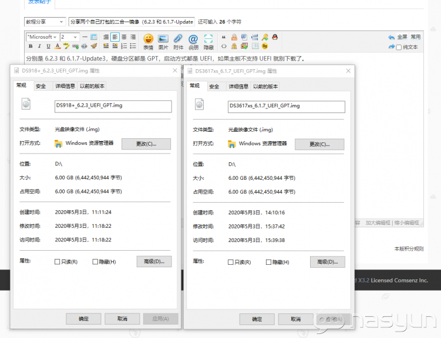
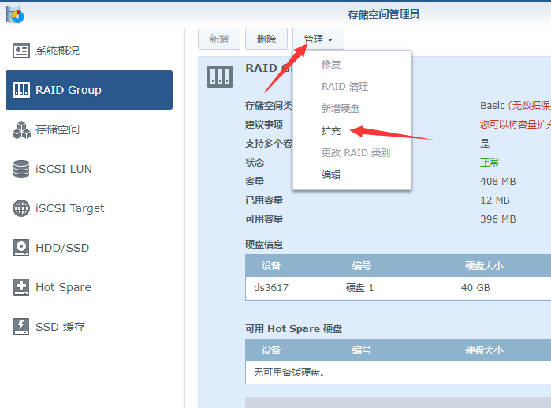
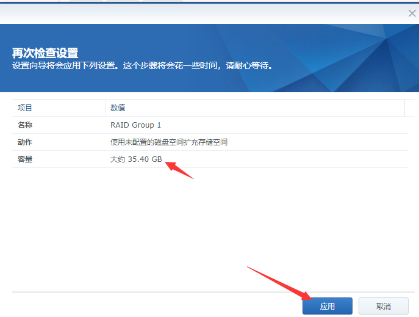
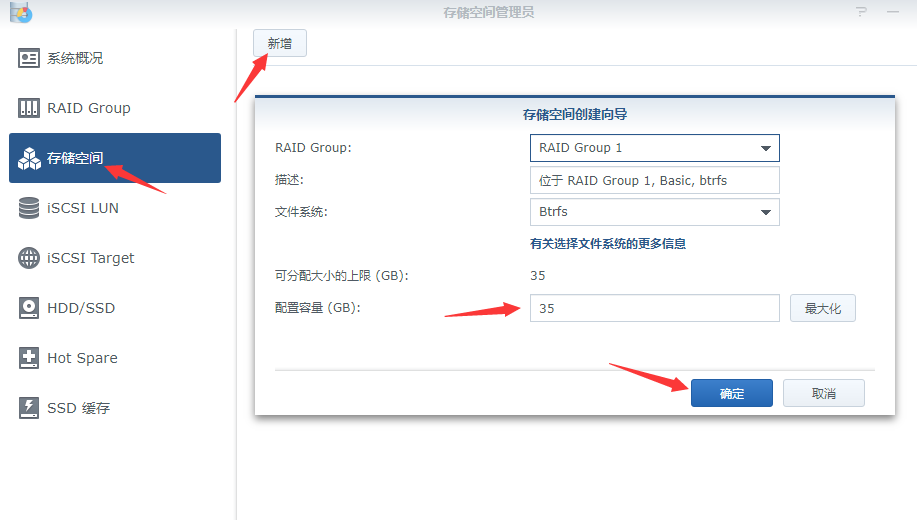
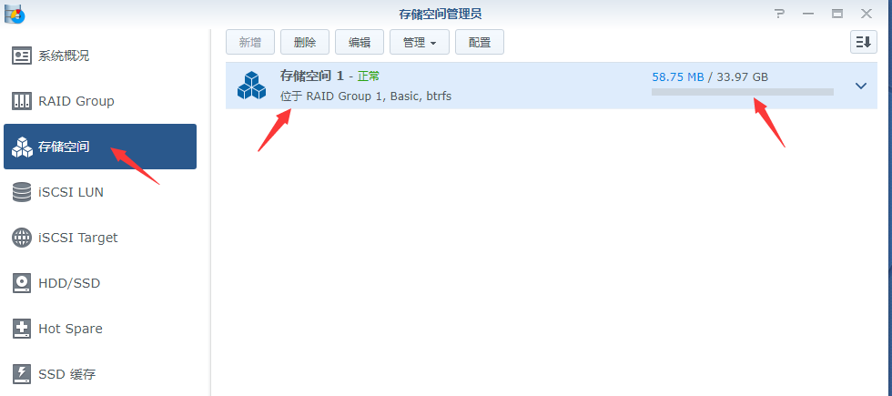

### 黑群晖二合一镜像（6.2.3 和 6.1.7）设置向导、分区自动扩容
打包的黑群二合一，分别是 DS918-6.2.3 和 DS3617-6.1.7Update3，硬盘分区都是 GPT，启动方式都是 UEFI，如果主板不支持 UEFI 就别下载使用了

引导程序都是 Jun 的修改版本，6.2.3 用的是 1.04b 已替换驱动文件，6.1.7 用的是 1.02b。

如果不在意硬件解码，可以考虑用 6.1.7 养老，这个可以锁定版本为 6.1.7。

安装方法跟其他二合一相似，直接做pe优盘引导，把写入工具和二合一img文件拷入你的pe优盘，再通过pe优盘启动进入系统，用写盘工具把二合一img写入到你的引导硬盘，切记，在写入你的引导硬盘前，记得用分区工具把你要写入的引导硬盘分区删除保存，再去写入。写好之后，拨掉优盘重启，通过写入的引导盘启动就可以了。

相关说明:  
镜像不同于网上的版本，这个是 6G 的镜像，所以 8G 的盘也可写入。
由于相对 14G 的版本少写入了 8G 的数据（虽然大部分是空白数据块），所以理论上写盘用时会相对快一些。

本二合一引导镜像，增加了自动扩容系统盘功能，请在设置向导完成后，手动重启一下NAS，即可进行扩容，扩容后请手动添加存储分区。另外，群晖限制需要至少 10G 才可以创建存储分区。

切记：引导好进入系统记得手动重启一次，再进去打开磁盘管理工具，才可以对磁盘扩容使用。

然后再点，上面的管理，扩充，应用。就可以了

点扩充，再就应用。

之后，再点存储空间，新增就可以了

这样扩容的存储空间就建立好了

网盘地址：  
https://pan.baidu.com/s/1hEqQV-YVLRm5ENhlWFmhnw?pwd=xzmf#list/path=%2F