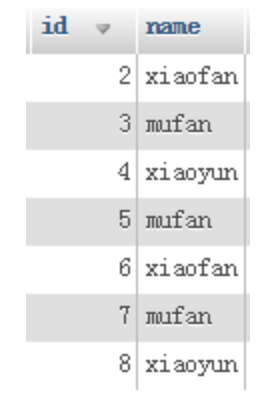
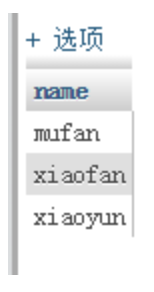
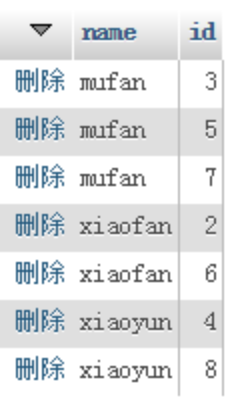

在使用mysql时，有时需要查询出某个字段不重复的记录，这时可以使用mysql提供的distinct这个关键字来过滤重复的记录，但是实际中我们往往用distinct来返回不重复字段的条数（count(distinct id)）,其原因是distinct只能返回他的目标字段，而无法返回其他字段，例如有如下表user:  
  
用distinct来返回不重复的用户名：select distinct name from user;，结果为:  
  
这样只把不重复的用户名查询出来了，但是用户的id，并没有被查询出来：  
```select distinct name,id from user```结果为：  
  
distinct name,id 这样的mysql 会认为要过滤掉name和id两个字段都重复的记录，如果sql这样写：```select id,distinct name from user```，这样mysql会报错，因为distinct必须放在要查询字段的开头。

所以一般distinct用来查询不重复记录的条数。  
如果要查询不重复的记录，有时候可以用group by ：    
```select id,name from user group by name;```


