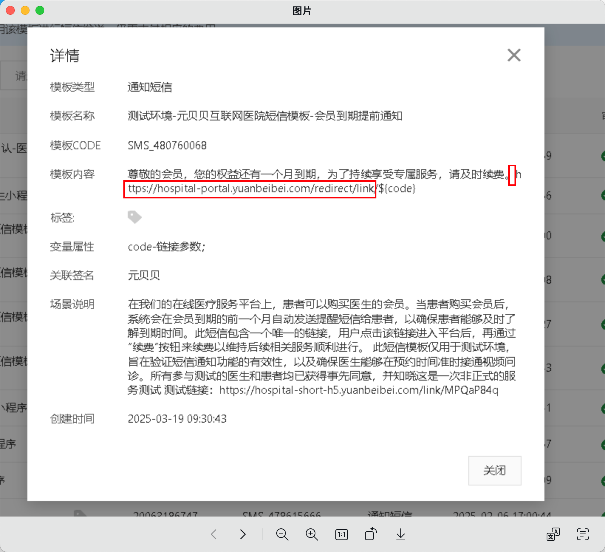
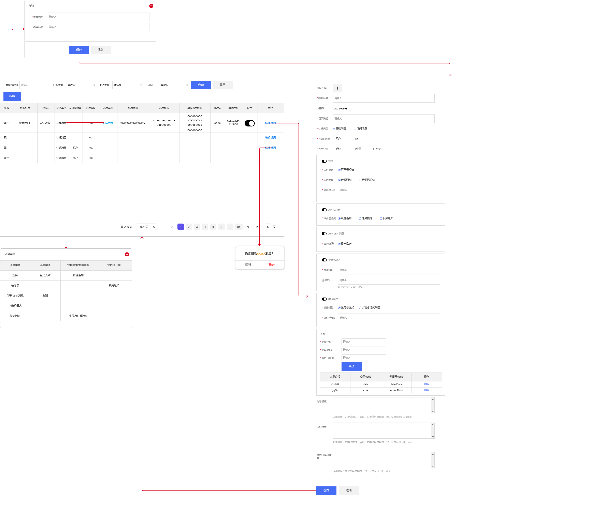

# 发送方式参数

## 业务域通用入参

- 租户id  
- 业务类型
- 发起推送应用端
- 模版id
- 业务变量信息
- 推送方式list
  - 通用参数
    - 接收人
      - 短信：手机号
      - app站内信：用户端sysuserid
      - app推送：医生的sysuserid
      - 微信：openid需要业务层传递
      - 企微机器人：无

- 支持业务域传入跳转链接
- 支持业务域传入参数由消息中心生成短链，链接内容只有短信消息才会展示，中转域名由消息中心统一拼接

## 相关校验

1. 模版启用状态
2. 模版可用业务类型
3. 

## 微信消息

1. 服务号消息和小程序消息  
目前系统中只是在小程序登录的时候存了小程序的openid和unid，服务公众号openid是在消息通过粉丝列表里面的unid对比，最终获取到服务公众号openid

## 短链和跳转

1. 阿里云sms配置的url链接，需要在消息中心做缩短处理后，传参给阿里云
2. 站内信：传人类型、地址
   1. 跳转h5
   2. 跳转小程序：appid、page
   3. 跳转自己的小程序：page
3. 微信消息：在接口中入参minigram处塞入
4. 所有跳转链接都需要业务传过来，不参与模版内容计算

### 微信

1. 服务号通知（模版消息）
   1. 接口文档：```https://developers.weixin.qq.com/doc/offiaccount/Message_Management/Template_Message_Interface.html```
   2. 跳转的小程序appid必须和公众号绑定
   3. 入参

   ```json
   {
           "touser":"OPENID",
           "template_id":"ngqIpbwh8bUfcSsECmogfXcV14J0tQlEpBO27izEYtY",
           "url":"http://weixin.qq.com/download",  
           "miniprogram":{
             "appid":"xiaochengxuappid12345",
             "pagepath":"index?foo=bar"
           },
           "client_msg_id":"MSG_000001",
           "data":{

                   "keyword1":{
                       "value":"巧克力"
                   },
                   "keyword2": {
                       "value":"39.8元"
                   },
                   "keyword3": {
                       "value":"2014年9月22日"
                   }
           }
       }
    ```  
  
   
2. 小程序订阅通知（订阅消息）
   1. 接口文档：```https://developers.weixin.qq.com/miniprogram/dev/OpenApiDoc/mp-message-management/subscribe-message/sendMessage.html```
   2. page	string	否	点击模板卡片后的跳转页面，仅限本小程序内的页面。支持带参数,（示例index?foo=bar）。该字段不填则模板无跳转
   3. 入参：

    ```json
        {
      "touser": "OPENID",
      "template_id": "TEMPLATE_ID",
      "page": "index?foo=bar",
      "miniprogram_state":"developer",
      "lang":"zh_CN",
      "data":{
            "phrase3": {
                "value": "审核通过"
            },
            "name1": {
                "value": "订阅"
            },
            "date2": {
                "value": "2019-12-25 09:42"
            }
        }
    } 
    ```


## 阿里云通知类型短链模版


```json
内容+https://hospital-test.ybbhealth.com/api/admin/shortUrl/redirect/link/${code}
```

## 微信小程序短链

1. 使用场景：sms通知短信外部打开小程序、app内打开小程序
2. 接口地址：  ```https://developers.weixin.qq.com/miniprogram/dev/OpenApiDoc/qrcode-link/url-link/generateUrlLink.html```
3. 接口参数：

```json
入参：  
{
    "path": "/pages/toolbox/patient-profile",
    "query": "  ",
    "expire_type":1,
    "expire_interval":1,
    "env_version": "release",
    "cloud_base":
    {
        "env": "xxx",
        "domain": "xxx.xx",
        "path": "/jump-wxa.html",
        "query": "a=1&b=2"
    }
} 
出参：
{
 "errcode": 0,
 "errmsg": "ok",
 "url_link": "URL Link"
} 


## 统一入口

1. 接口地址：/media/sendGeneralMsg
2. 入参：
  
```json
{
  "tenantId": 10001,
  "businessType": "ORDER_NOTICE",
  "sourceType": "MINI_PROGRAM",
  "templateCode": "TPL_20240603_001",
  "param": {
    "userName": "张三",
    "orderNo": "ORD20240603001",
    "amount": "¥128.00"
  },
  "sendTypeContentList": [
    {
      "sendTypeCode": 1,
      "recipient": "13800138000",
      "extra": {
        "signName": "云鹿科技",
        "templateParam": "{\"code\":\"123456\"}"
      }
    },
    {
      "sendTypeCode": 3,
      "recipient": "oX2Z35Y-vbOeH5JkSd2yVlNwF_9I",
      "extra": {
        "miniprogramState": "formal",
        "pagePath": "pages/order/detail?id=10086"
      }
    }
  ],
  "routeType": "DETAIL",
  "routeLink": "/order/detail/10086"
}

```

## 环境变量

```SPRING_AMQP_DESERIALIZATION_TRUST_ALL=true```

## 阿里云配置
https://wxaurl.cn/Q4FPYHCSjNp  
https://hospital-test.ybbhealth.com/api/admin/appRedirect/{code}

## 入参

```json
微信公众号摸板通知：
{
    "tenantId": 10001,
    "businessType": "ORDER_NOTICE",
    "sourceType": "MINI_PROGRAM",
    "templateCode": "yl_hz_wz_0000007",
    "param": {
        "thing2": "cscs",
        "const8": "测试8",
        "thing4": "测试4",
        "time6": "2025-06-03 16:28:52"
    },
    "sendTypeContentList": [
        {
            "sendTypeCode": 6,
            "recipient": "ojawA7MM5uusYrHf-qtnr-hl6t6w",
            "jumpFlag": true,
            "wechatMsgJumpParamDTO": {
                "url": "",
                "miniProgram": {
                    "appid": "wxfa24bdeb2495b833",
                    "pagePath": "pages/new-index/index",
                    "usePath": true
                },
                "page": ""
            },
            "extra": {

            }
        }
    ]
}
sms短信
{
    "tenantId": 10001,
    "businessType": "ORDER_NOTICE",
    "sourceType": "MINI_PROGRAM",
    "templateCode": "yl_hz_wz_0000007",
    "param": {
        "thing2": "cscs",
        "const8": "测试8",
        "thing4": "测试4",
        "time6": "2025-06-03 16:28:52"
    },
    "sendTypeContentList": [
        {
            "sendTypeCode": 6,
            "recipient": "ojawA7MM5uusYrHf-qtnr-hl6t6w",
            "jumpFlag": true,
            "wechatMsgJumpParamDTO": {
                "url": "",
                "miniProgram": {
                    "appid": "wxfa24bdeb2495b833",
                    "pagePath": "pages/new-index/index",
                    "usePath": true
                },
                "page": ""
            },
            "extra": {

            }
        }
    ]
}
站内信
{
    "tenantId": 10001,
    "businessType": "ORDER_NOTICE",
    "sourceType": "MINI_PROGRAM",
    "templateCode": "yl_hz_wz_0000007",
    "param": {
        "thing2": "cscs",
        "const8": "测试8",
        "thing4": "测试4",
        "time6": "2025-06-03 16:28:52"
    },
    "sendTypeContentList": [
        {
        "internalMsgJumpParmDTO": {
        "routeType": 1,
        "routeLink": "",
        "appId": ""
        }
      }
    ]
}
```


