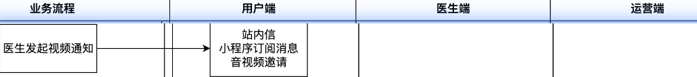
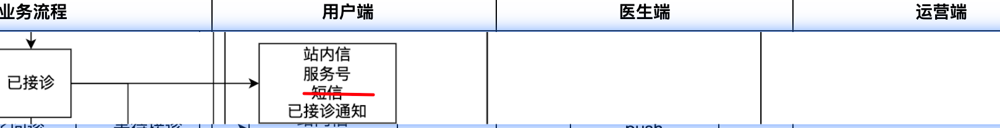
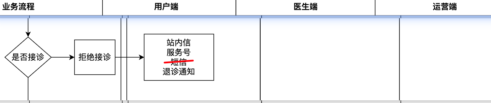
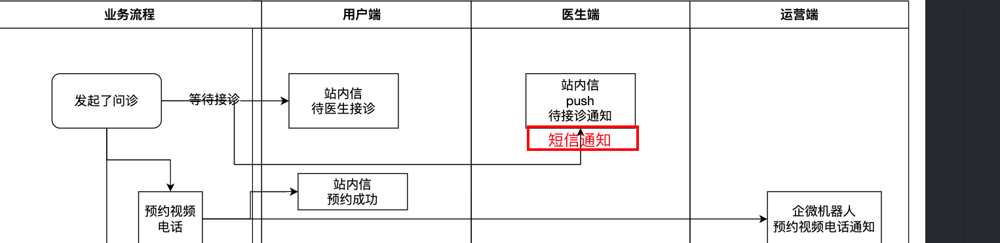
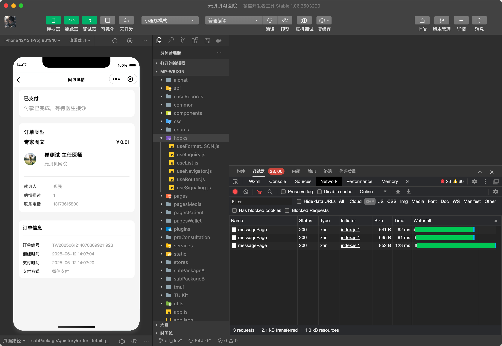

# 进度

## 优先级

问诊 会员 问卷 计划 处方 订单

## 场景

### 医生发起视频问诊（完成）

1. 发患者：视频通话提醒 pt_inquiry_0000004
   1. 站内信
   2. 微信小程序订阅消息
   3. 跳转im页面
   4. 

### 医生接诊成功（完成）

1. 发患者：pt_inquiry_0000002  
   1. 站内信
   2. 微信模版消息（服务号）
   3. 跳转im页面
2. 接口：user/inquiry/acceptOrder
3. 

### 视频问诊在预约时间10分钟后未发起有效视频时提醒

1. 发医生：

### 医生退拒诊（完成）

1. 发患者：pt_inquiry_0000007
   1. 微信模版（服务号）
   2. 站内信
   3. 跳转问诊详情页
   4. 

### 问诊完成（完成）

1. 发运营：yy_inquiry_0000001
   1. 企微：跳问诊订单页面
   2. user/inquiry/writeOffOrder

### 问诊超时（医生端im跳转未通）

1. 发医生：dc_inquiry_0000003
   1. 普通站内信
   2. 调整医生端IM页（不通）
2. 发运营：yy_inquiry_0000001
   1. 企微：跳问诊订单页面（完成）
   2. user/inquiry/writeOffOrder

### 患者问诊（提交）支付完成

1. 发医生 dc_inquiry_0000001 接诊提醒
   1. 站内信
   2. push
   3. sms（未通）
   4. todo：跳转app （不通）
2. 发患者 pt_inquiry_0000001 （完成）
   1. 站内信
   2. 跳转问诊详情页（完成）
3. （电话视频类问诊）发运营 yy_inquiry_0000002（完成）
   1. 企微：预约视频电话通知 （完成）
4. 流程：

### 患者预约电话、视频问诊（im未测）

1. 给医生： dc_inquiry_0000004
2. 语音、视频问诊预约提前5分钟通知
（点击开始咨询时，出现申请小程序订阅消息）
3. 跳转医生端im页面

### 退款申请（完成）

1. 发运营：yy_order_0000001 

### 后台退款申请审批通过（）

1. 发医生：dc_inquiry_0000005
   1. 站内信()
   2. apppush
   3. 跳转问诊详情页
2. 

### 医生开处方

1. 发患者：pt_prescription_0000001（完成）
   1. 站内信
   2. 微信服务号模版消息
2. 发药师：ys_prescription_0000001(未写)
   1. 站内信
   2. apppush
   3. 跳处方详情页
3. 接口：clientDoctors/prescription/submitChineseMedicinePrescription
4.     public void commitSuccess(PrescriptionOrder prescriptionOrder, YlUser ylUser) {

### 药师审方通过

 1. dc_prescription_0000001
 2. public void authSuccess(PrescriptionOrder prescriptionOrder, PrescriptionDetailVO prescriptionDetailVO) {

### 药师审方不通过

 1. dc_prescription_0000002
 2. public void authSuccess(PrescriptionOrder prescriptionOrder, PrescriptionDetailVO prescriptionDetailVO) {}

### 问诊订单退款

1. 发运营：yy_order_0000001
   1. 企微；跳售后单列表(退款申请页面)
2. 接口：refund/getway/refund

### 医生提现(调通)

1. 给医生 dc_point_0000002
   1. 验证码

### 医生提现成功

1. 给运营 yy_point_0000001
   1. 验证码

### 积分变动（跳转未测试）

1. 给医生 dc_point_0000001
   1. 站内信
   2. apppush
