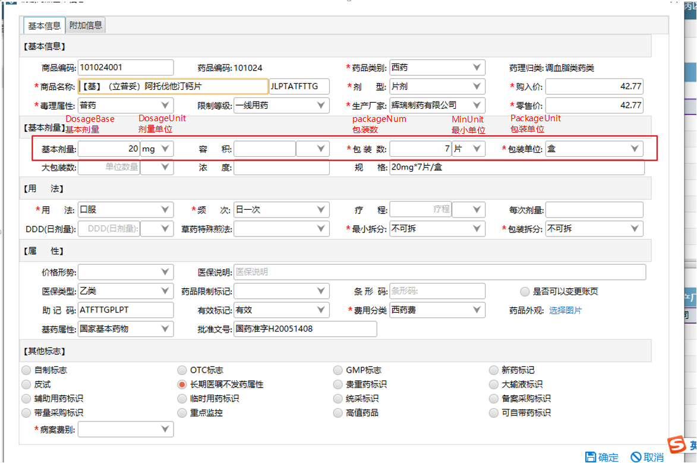
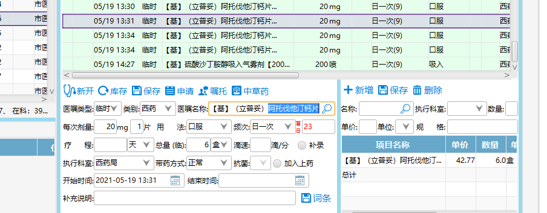
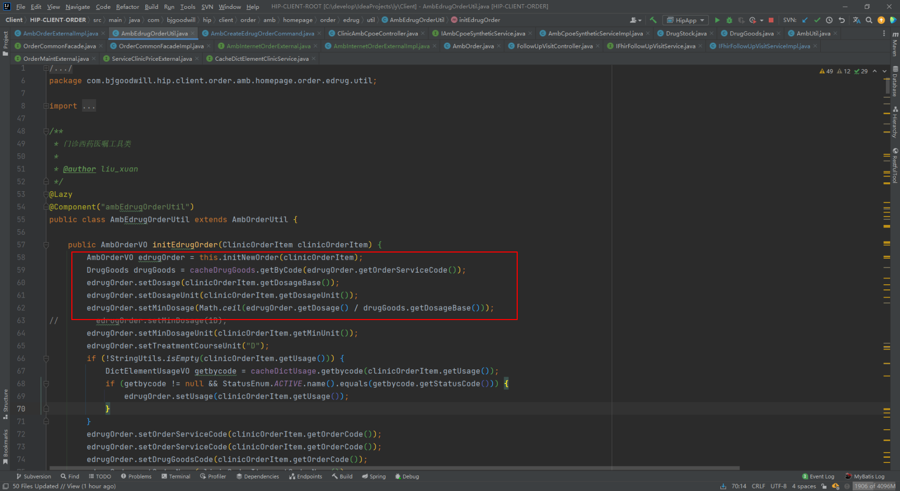
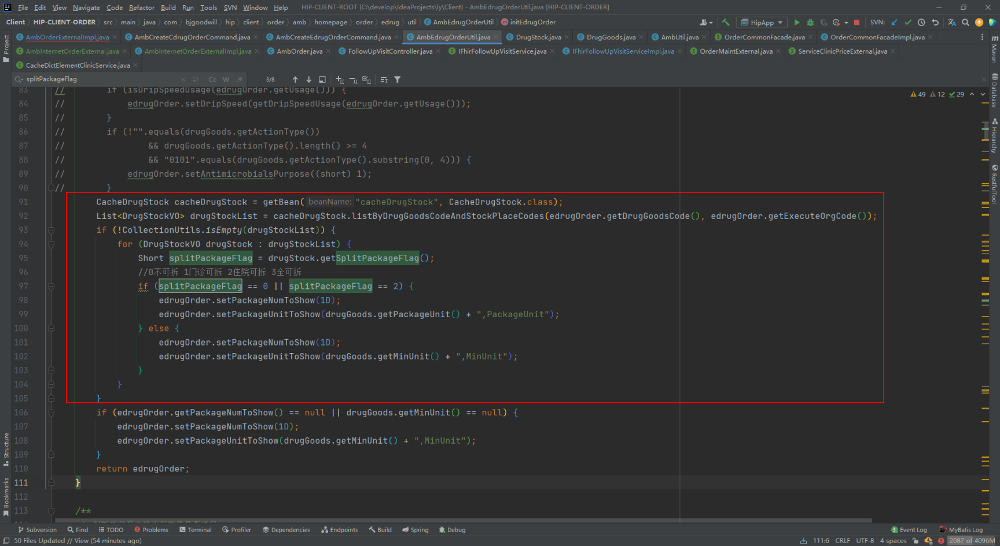

*  医嘱表药品单位保存规则：
	* 开6盒 存的是最小单位 一共有多少 一盒7片 就存42 单位是片
	* 基本计量单位字典 DosageUnit 最小单位字典 MinUnit 包装单位字典 PackageUnit
	*  数据查询的时候会用总量除以每盒的量去算是按包装数还是最小单位

```
/*最小单位——包装单位 （总量、单位转换）*/  
DrugGoods drugGoods = orderCommonFacade.getDrugGoodsByCode(impOrderDO.getDrugGoodsCode());  
if ("2".equals(impOrderVO.getOrderType())) {  
    if (drugGoods != null && impOrderDO.getPackageNum() != null) {  
        if (impOrderDO.getPackageNum() % drugGoods.getPackageNum() == 0) {  
            impOrderVO.setPackageNum(impOrderDO.getPackageNum() / drugGoods.getPackageNum());  
            impOrderVO.setPackageUnit(drugGoods.getPackageUnit() + "," + "PackageUnit");  
        } else {  
            impOrderVO.setPackageNum(impOrderDO.getPackageNum());  
            impOrderVO.setPackageUnit(impOrderDO.getPackageUnit() + "," + "MinUnit");  
        }  
    }}

规格：DosageBase+ DosageUnit  * packageNum +MinUnit/PackageUnit

```
  `20mg * 7片 / 盒`








