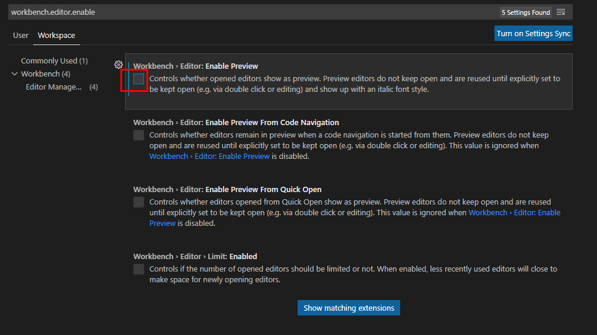

# 解决 vs code 打开文件总是只有一个tab标签页，新打开的tab标签页会替换掉旧的tab标签页

在Visual Studio Code

1. 设置. show tabs 取消打勾，再次打勾  
2. 关闭预览功能。
设置中搜索 workbench.editor.enablePreview ,找到此项后，保持不勾选状态，这样就会关闭了预览模式，打开的文件都会生成新的标签页

## vscode打开多个文件多行显示

不设置时，当打开多个文件时，需要使用鼠标滑动滚动条才能看到后面打开的文件。  
打开设置后，效果是这样的，打开多个文件时，所以文件都能显示出来，看代码非常的nice!!
设置步骤

- 按住 ctrl + shift + p  
- 输入 open workspace settings,选择打开工作区设置  
- 输入workbench.editor.wrapTabs，勾选该设置项即可
