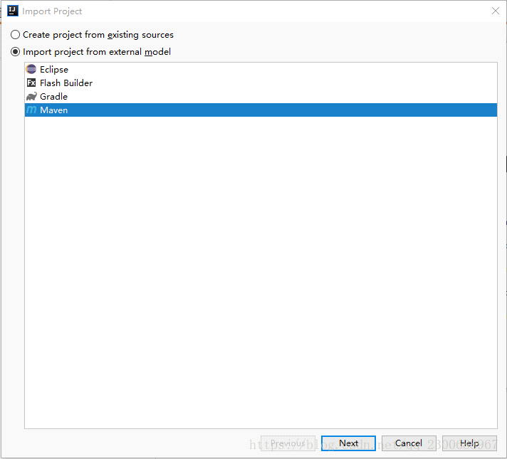

 

2020年7月12日

10:33

 

IDEA 导入项目时 "Import project from external model" 和 "Create project from existing sources"的选择

技术标签： [Import project from external m](https://www.pianshen.com/tag/Import+project+from+external+m/)  [Create project from existing s](https://www.pianshen.com/tag/Create+project+from+existing+s/)

 

1，如图所示，当我们导入一个项目时，常常见到下面的两个选择

1）Create project from existing sources

2）Import project from external model

2，区别：

1）如果选择Create project from existing sources选项， 则你只能导入使用idea创建的项目源码

2）如果选择Import project from external model，则你可以导入Eclipse/Flash Builder等创建的项目，这些项目将会被成功的被转idea项目文件
