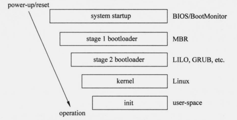

### 【干货】BIOS、UEFI、MBR、GPT、GRUB 到底是什么意思？

#### 02 与操作系统启动相关的几个概念
不管是 Windows 还是 Linux 操作系统，底层设备一般均为物理硬件，操作系统启动之前会对硬件进行检测，然后硬盘引导启动操作系统，以下是与操作系统启动相关的几个概念。
#### 2.1 BIOS
BIOS（Basic Input Output System），直译成中文名称就是"基本输入输出系统"。它是一组固化到主板中一个ROM芯片上的程序，它可以从CMOS中读写系统设置的具体信息。此程序保存着计算机最重要的基本输入输出程序、开机后的自检程序和系统自启动程序。
简单来说，BIOS是一个控制电脑中所有输入输出的程序，它可以对主板上的键盘、鼠标、外部接口、频率、电源、磁盘驱动器等方面进行参数控制和调整。

#### 2.2 UEFI
UEFI（Unified Extensible Firmware Interface）则是取代传统BIOS的，相比传统BIOS来说，它更易实现，容错和纠错特性也更强。

传统BIOS主要支持MBR引导，UEFI则是取代传统BIOS，它加入了对新硬件的支持，其中就有支持2TB以上硬盘。

#### 2.3 MBR与GPT
全新硬盘在使用之前必须进行分区格式化，硬盘分区初始化的格式主要有两种，分别为MBR格式和GPT格式。
#### 2.3.1 MBR
MBR是传统的分区表类型，当一台电脑启动时，它会先启动主板上的BIOS系统，BIOS再从硬盘上读取MBR主引导记录，硬盘上的MBR运行后，就会启动操作系统，但最大的缺点则是不支持容量大于2T的硬盘。
如下图，查询到小编的磁盘分区类似为：MBR

查询方法如下，感兴趣的同学可以查询下自己电脑的磁盘分区类型。

1、win+R，输入diskmgmt.msc，回车，打开磁盘管理器。
2、在磁盘上点右键，选属性。
3、在卷这一页，可以看到是GTP还是MBR。
2.3.2 GPT
而GPT是另一种更先进的磁盘系统分区方式，它的出现弥补了MBR这个缺点，最大支持18EB的硬盘，是基于UEFI使用的磁盘分区架构。

目前所有Windows系统均支持MBR，而GPT只有64位系统才能支持。BIOS只支持MBR引导系统，而GPT仅可用UEFI引导系统。正因为这样，现在主板大多采用BIOS集成UEFI，或UEFI集成BIOS，以此达到同时兼容MBR和GPT引导系统的目的。
#### 2.3.3 总结
- BIOS+MBR：  
这是最传统的，系统都会支持；唯一的缺点就是不支持容量大于2T的硬盘。
- BIOS+GPT：  
BIOS是可以使用GPT分区表的硬盘来作为数据盘的，但不能引导系统；若电脑同时带有容量小于2T的硬盘和容量大于2T的硬盘，小于2T的可以用MBR分区表安装系统，而大于2T的可以使用GPT分区表来存放资料。但系统须使用64位系统。
- UEFI+MBR：  
可以把UEFI设置成Legacy模式（传统模式）让其支持传统MBR启动，效果同BIOS+MBR；也可以建立FAT分区，放置UEFI启动文件来，可应用在U盘和移动硬盘上实现双模式启动。
- UEFI+GPT：  
如果要把大于2T的硬盘作为系统盘来安装系统的话，就必须UEFI+GPT。而且系统须使用64位系统，否则无法引导。但系统又不是传统在PE下安装后就能直接使用的，引导还得经过处理才行。
#### 2.4 GRUB
GRUB（GRand unified bootloader）,多操作系统启动程序。它允许用户可以在计算机内同时拥有多个操作系统，并在计算机启动时选择希望运行的操作系统。

GRUB可用于选择操作系统分区上的不同内核，也可用于向这些内核传递启动参数。它是一个多重操作系统启动管理器，用来引导不同系统，如Windows、Linux。Linux常见的引导程序包括LILO、GRUB、GRUB2。如下图所示为GRUB加载引导流程。

Centos 7 默认使用GRUB2引导系统启动,GRUB2 是基于 GRUB 开发成更加安全强大的多系统引导程序，最新Linux发行版都是使用GRUB2作为引导程序。同时GRUB2采用了模块化设计，使得GRUB2核心更加精炼，使用更加灵活，同时也就不需要像GRUB分为 stage 1、stage 1.5、stage 2三个阶段。