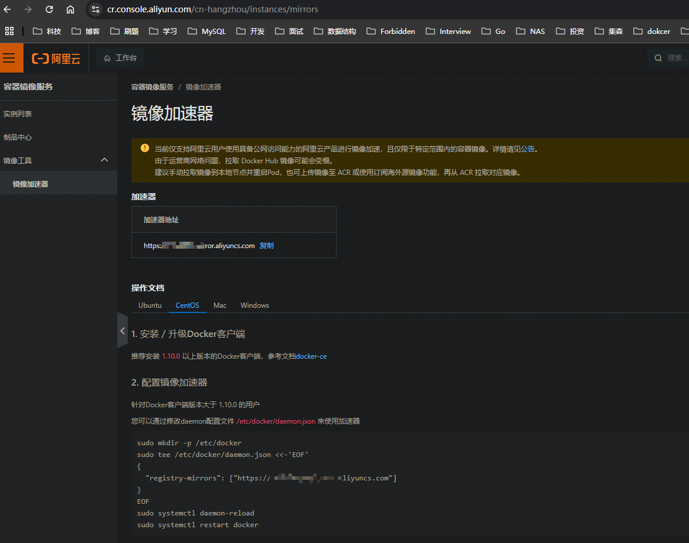

# 阿里云ecs安装docker

以下是2025年阿里云ECS CentOS 7.9安装Docker和Docker Compose的最新教程：


### **一、安装Docker**

1. **卸载旧版本（如存在）**

```bash
sudo yum remove docker docker-client docker-client-latest docker-common docker-latest docker-latest-logrotate docker-logrotate docker-engine
```

1. **安装依赖工具**

```bash
sudo yum install -y yum-utils device-mapper-persistent-data lvm2
```

2. **配置阿里云镜像源**

```bash
sudo yum-config-manager --add-repo https://mirrors.aliyun.com/docker-ce/linux/centos/docker-ce.repo
```

3. **安装Docker CE**

```bash
sudo yum install -y docker-ce docker-ce-cli containerd.io docker-buildx-plugin
```

4. **启动Docker并设置开机自启**

```bash
sudo systemctl start docker
sudo systemctl enable docker
```

5. **验证安装**

```bash
sudo docker version
sudo docker run hello-world  # 测试容器运行
```

6. **配置镜像加速器（推荐）**

```bash
sudo tee /etc/docker/daemon.json <<-'EOF'
{
  "registry-mirrors": ["https://<你的阿里云加速器ID>.mirror.aliyuncs.com"]
}
EOF
sudo systemctl restart docker
```

*注：阿里云镜像加速器地址需登录容器镜像服务控制台获取*



### **二、安装Docker Compose**

1. 安装Docker Compose
   - **方法一：下载二进制文件（国内镜像）**

    ```shell
    sudo curl -L "https://get.daocloud.io/docker/compose/releases/download/latest/docker-compose-$(uname -s)-$(uname -m)" -o /usr/local/bin/docker-compose
    ```

   - **方法二：通过 pip3 安装（避免网络问题）**

         **1. 安装基础编译工具链**

        ```bash
        sudo yum install -y gcc make openssl-devel bzip2-devel libffi-devel zlib-devel
        ```

         **2. 安装Python开发包**

        ```bash
        sudo yum install -y python3-devel  # 对应Python 3.6版本
        ```

         **3. 更新pip并重试安装**

        ```bash
        sudo pip3 install --upgrade pip setuptools wheel
        sudo pip3 install pynacl  # 重新运行原安装命令
        ```

         **4. 验证GCC环境**
        
        ```bash
        gcc --version  # 确认输出类似"gcc (GCC) 4.8.5"
        ```
        **5. 安装docker-compose**
        ```shell
        sudo yum install -y python3-pip  
        sudo pip3 install docker-compose
        ```

```

2. **赋予执行权限**

```shell
sudo chmod +x /usr/local/bin/docker-compose
```

3. **创建软链接**

```shell
sudo ln -s /usr/local/bin/docker-compose /usr/bin/docker-compose
```

4. **验证安装**

```shell
docker-compose --version
```
