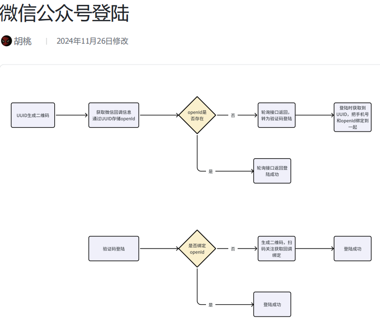
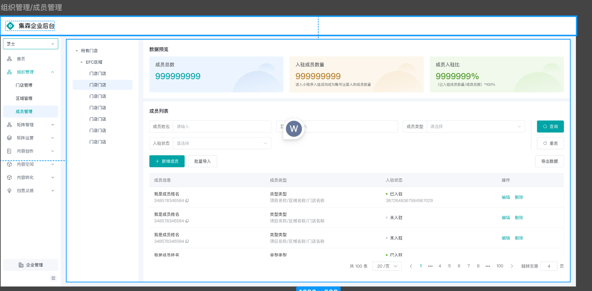
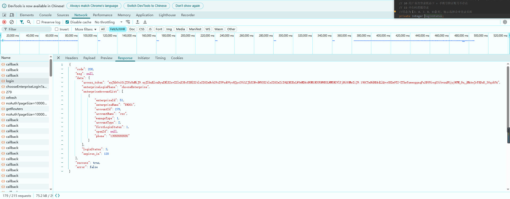

# 微信公众号登录

## 登录接口

- 流程图
  

- 入参

- 响应

## 流程

1. 前端生成uuid，携带uuid，调用后端获取临时二维码接口
2. 后端生存带有uuid参数的二维码图片链接给前端：
   1. 获取微信公众号统一accsss_token
   2. 获取ticket(接口地址+入参accsss_token)，创建二维码ticket
   3. 调showqrocde接口（通过ticket换取二维码url）
3. 用户扫码后：
   1. 微信后台配置的有服务端回调接口的地址
   2. 用户未关注
      1. 推送到服务端
   3. 用户已关注
      1. 推送到服务端
      2. 服务的处理逻辑：将前端uuid值做key，微信openid做value存入redis
4. 前端不断轮询调用callback接口
   1. 传入uuid
   2. 后端查询redis，获取到openid
   3. 通过openid查询是否有绑定账号
      1. 没有：
         1. 跳手机号登录
         2. 登录接口通过uuid查询openid，将openid绑定到账号上写入库中
      2. 有：下发token直接登录  
