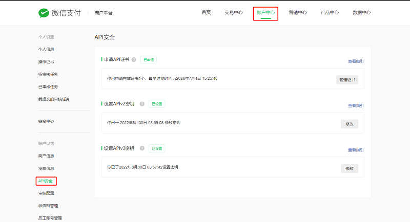
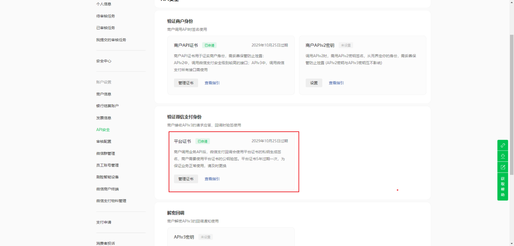
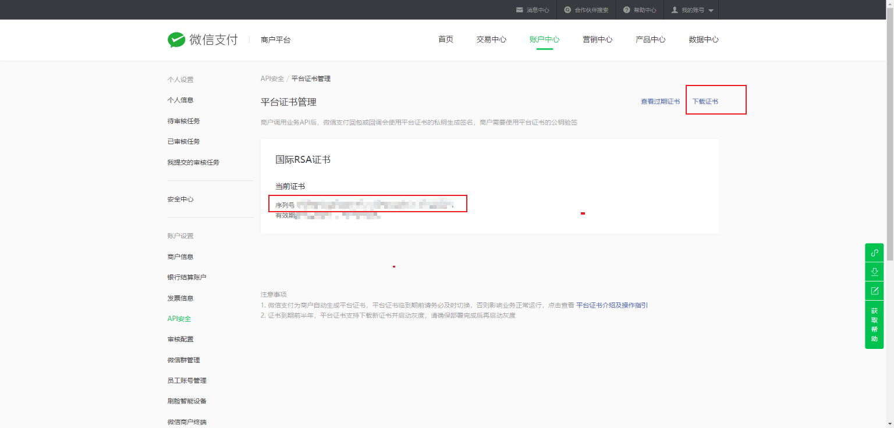
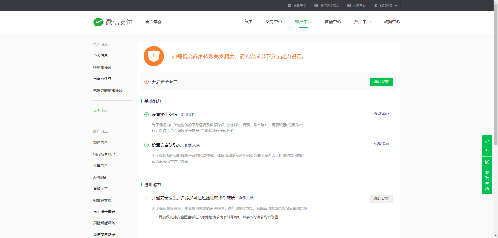

# 加密相关

## API v3密钥

1. 为了保证安全性，微信支付在 回调通知和平台证书下载接口中，对关键信息进行了AES-256-GCM加密。API v3密钥是加密时使用的对称密钥  
2. 商户需先在【商户平台】->【账户中心】->【API安全】的页面设置该密钥，请求才能通过微信支付的签名校验。密钥的长度为32个字节。
3.   
4. 这个错误通常与Java中使用的加密库有关，具体来说是由于Java运行时环境（JRE）的政策限制了某些密钥长度。在某些地区，由于出口法规的限制，默认情况下Java只支持有限长度的密钥（通常是128位）。如果你的应用程序尝试使用更长的密钥（例如256位），则会抛出java.security.InvalidKeyException: Illegal key size异常。

要解决这个问题，你需要安装Java Cryptography Extension (JCE) Unlimited Strength Jurisdiction Policy Files。这是一组额外的策略文件，可以让你的JRE支持任意长度的密钥。以下是安装步骤：

确定你正在使用的JDK版本。
下载对应版本的JCE Unlimited Strength Jurisdiction Policy Files：
对于JDK 8：JCE 8  

```url
https://www.oracle.com/java/technologies/javase-jce8-downloads.html?spm=5176.28103460.0.0.40f75d27ZfgUYz  
```  

对于更新的版本，请查找相应版本的下载链接。
解压下载的文件，你会看到两个.jar文件：local_policy.jar和US_export_policy.jar。
找到你的JDK安装目录下的jre/lib/security/文件夹，并用解压出来的两个.jar文件替换原有的同名文件。
重启你的应用程序或IDE以使更改生效。
完成以上步骤后，你应该能够使用任何长度的密钥而不会遇到“非法密钥大小”的错误。

请注意，从JDK 9开始，无限强度的加密策略已经成为默认设置，因此对于JDK 9及以上版本，你不需要再单独下载和安装这些策略文件。

如果你已经确认JCE无限制策略文件已正确安装，但仍然遇到此问题，请检查是否有其他安全配置或自定义的安全管理器可能影响了密钥的使用。

申请了商户api证书后，微信平台证书需要调用接口下载





微信支付可以用两个商户证书，一套微信支付平台证书吗
在微信支付的体系中，每个商户号（MCHID）都有其对应的商户证书，用于确保交易的安全性和数据的完整性。这里的“商户证书”指的是商户在微信支付平台上注册并下载的证书，主要用于对API请求进行签名验证等安全措施。

商户证书：每个商户号（MCHID）有自己独立的商户证书。这意味着，如果您有两个不同的商户号，那么这两个商户号应该各自拥有自己的商户证书，不能共用同一份商户证书。
微信支付平台证书：这里可能是指API V3密钥（apiv3key）或者是微信支付平台提供的公共证书。API V3密钥是用于对请求和响应进行加密解密的关键，而微信支付平台的公共证书则是用于验证微信支付平台发送的数据的真实性。这些密钥和证书是根据商户号来配置的，而不是根据商户证书的数量。
总结来说，两个不同的商户号不能共享同一个商户证书。每个商户号都需要有自己的证书，以保证交易的安全性和独立性。

我的意思是，同一个商户号，现在申请两个商户证书，是不是之前的微信支付平台证书也可以用
对于同一个商户号（MCHID），微信支付允许申请多份商户证书，但每份证书的用途和应用场景可能会有所不同。

证书的类型和用途：

- 商户证书：这是您为特定商户号申请的证书，用于API请求的签名、验签等安全措施。每个商户号可以申请多份证书，但每份证书有其有效期，且多份证书之间不会互相影响。
- 平台证书：这是微信支付平台提供的证书，用于验证微信支付平台返回的数据真实性。平台证书与商户号无关，而是全局性的，所有商户都可以使用。
- 证书的兼容性：
对于同一个商户号，您可以申请多份商户证书，并且这些证书可以同时有效。这意味着您可以在不同的应用或者环境中使用不同的商户证书，但它们都对应同一个商户号。
之前已有的微信支付平台证书仍然可以继续使用，因为平台证书是全局的，不依赖于商户号的商户证书。

总结，同一个商户号下申请两份商户证书是可行的，并且之前已有的微信支付平台证书依然可以继续使用。