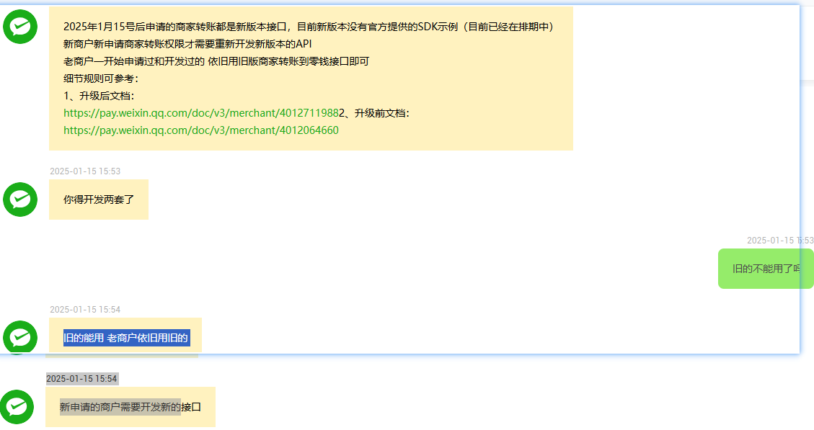

```

2025年1月15号后申请的商家转账都是新版本接口，目前新版本没有官方提供的SDK示例（目前已经在排期中）
新商户新申请商家转账权限才需要重新开发新版本的API
老商户一开始申请过和开发过的 依旧用旧版商家转账到零钱接口即可
细节规则可参考：
1、升级后文档：
https://pay.weixin.qq.com/doc/v3/merchant/40127119882、升级前文档：
https://pay.weixin.qq.com/doc/v3/merchant/4012064660

```

