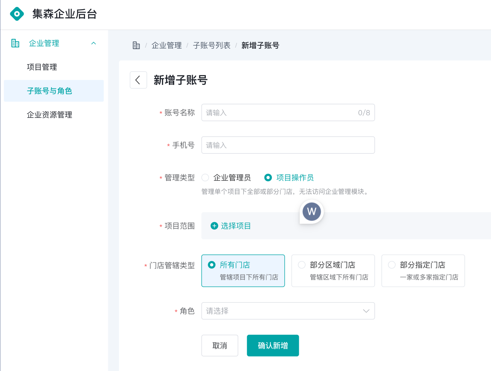
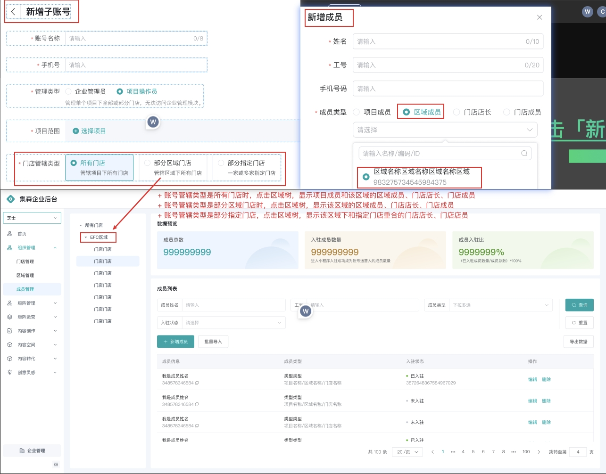
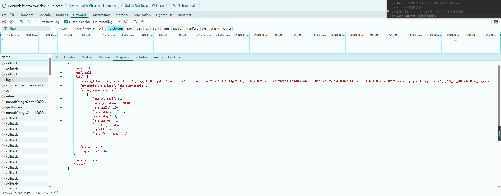
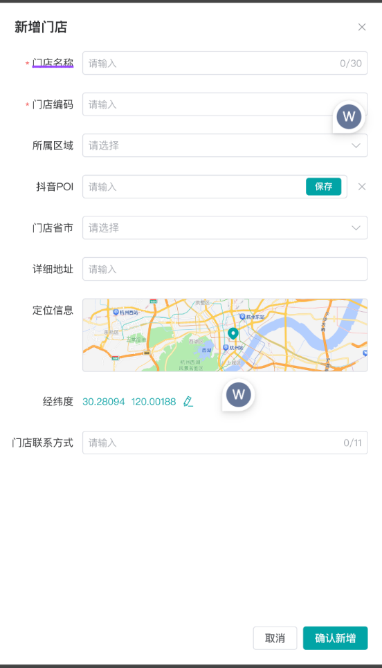
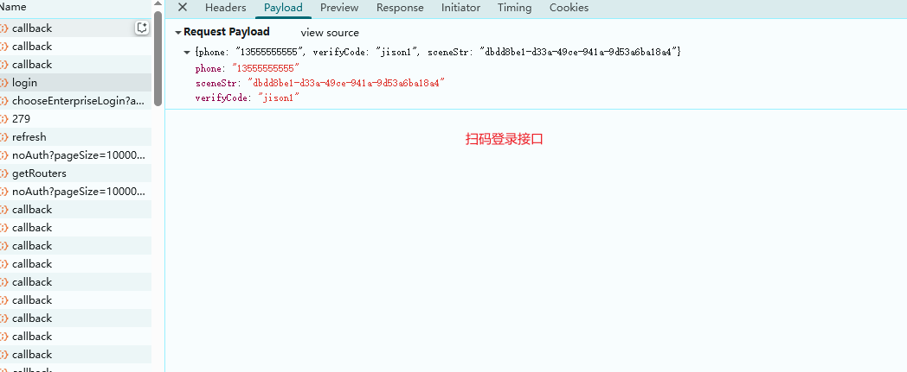
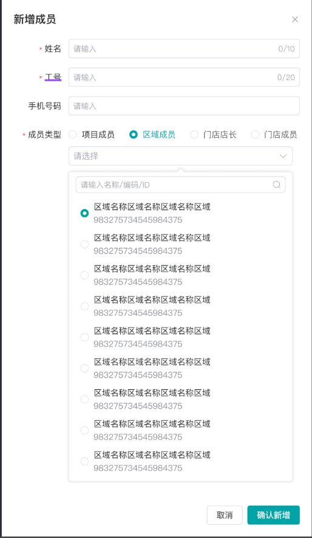

# 数据权限问题

1. 区域是由企业管理员点进去某一项目后，手动新增或批量导入区域维护的
2. 维护某一项目里面的数据时（区域、门店、成员），需要前端请求头中带有项目id
3. 新增门店时，若无上级区域id，则取请求头中项目id值，存入上级区域id

## 子账号

- 角色
  - 企业管理员
    - 所有项目，所有数据都可维护
  - 项目目管理员
    - 管理一个项目，需要选择管理类型（所有门店、部分区域、部分门店）

## 区域管理（无结构树）

- 项目名称 同一企业下唯一
- 区域编码、区域名称 同一项目下唯一

- 数据权限（哪些数据展示出来）
  - 企业管理员
    - 通过项目id查询区域表，显示当前项目下所有区域
  - 项目管理员
    - 门店管辖类型为【所有门店】，可查看所有区域数据
      - 通过项目id查询区域表，显示当前项目下所有区域
    - 门店管辖类型为【部分区域门店】，仅展示管辖区域的数据  
      - 将当前登录人，**账号区域关联表**，取区域数据
    - 门店管辖类型为【部分指定门店】，提示【无区域管辖权限】
      - 无数据
  
## 门店管理（左侧显示区域树）

- 数据权限（哪些数据展示出来）
  - 根据门店范围显示
  - 企业管理员
    - 点击所有门店：
      - 通过项目id，查门店表（项目id）
    - 构建区域树：
      - 通过项目id，查询区域表
    - 点击区域树：
      - 通过区域id，查询门店表（上级区域id）

  - 项目管理员
    - 门店管辖类型为【所有门店】
      - 同企业管理员  
    - 门店管辖类型为【部分区域门店】
      - 通过**账号区域关联表**，查出所有区域（区域树），通过区域查处所有门店数据
    - 门店管辖类型为【部分指定门店】
      - 通过**账号门店关联表**，查出所有门店数据，反查区域分组数据（区域树）
  
## 成员管理（左侧显示 所有成员-区域-门店树）

- 数据权限
  - 企业管理员
    - 点击所有成员：
      - 通过项目id，查成员表（项目id）
    - 构建区域门店树：
      - 通过项目id，查询区域（区域树），通过区域ids，查询门店（门店树）
    - 点击区域树：
      - 通过区域id，查区域下门店（上级区域id），通过门店查成员（所属组织id）
      - 通过区域id，查成员（所属组织id + 区域成员类型）
    - 点击门店树：
      - 通过门店id，查门店下成员（所属组织id）
  - 项目管理员
  - 根据子账号数据权限确认左侧组织结构树的展示
    - 所有门店可查看全部组织
      - 同企业管理员
    - 部分区域门店可查看管辖区域的区域和区域下所有门店
      - 点击所有成员：
        - 通过**账号区域关联表**，查出所有区域（区域树），通过区域查处所有门店数据（门店树），通过门店数据查所有成员
      - 构建区域门店树
        - 通过**账号区域关联表**，查出所有区域（区域树），通过区域查处所有门店数据（门店树）
      - 点击区域
        - 通过区域查处所有门店数据，通过门店数据查所有成员（所属组织id）
        - 通过区域id，查成员（所属组织id + 区域成员类型）
      - 点击门店
        - 通过门店数据查所有成员（所属组织id）
    - 部分指定门店
      - 点击所有成员：
        - 通过**账号门店关联表**，查出所有门店数据，通过门店查成员
      - 构建区域门店树
        - 通过**账号门店关联表**，查出门店树->区域树
      - 点击区域：
        - 通过**账号门店关联表**，查出门店数据+上级区域id，过滤符合的门店，通过门店查成员（上级组织id+门店成员类型）
      - 点击门店：
        - 通过门店查成员（上级组织id+门店成员类型）
- 新增区域：只能企业管理员 /所有门店 (门店管辖类型)
- 新增门店：只能企业管理员 /所有门店 、部分区域类型(门店管辖类型)
  