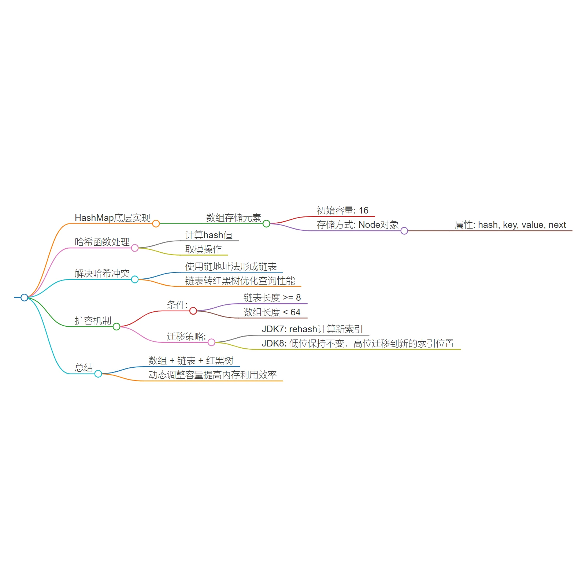

# hashmap底层原理

HashMap的基本结构——基于数组存储键值对，并提到其默认初始化容量为16。每个数组单元称为“桶”，用于存放Node对象（包含key、value以及next指针）。插入时，通过对key计算hash值并取模确定桶索引，若发生冲突，则形成链表结构。

接着讨论了链表转红黑树的情况。当某个桶内的链表长度超过8且总数组长度达64时，该链表会被转换为红黑树，提高查找效率至O(logN)。然而，在数组长度不足64的情况下，系统选择扩容而非转变为红黑树，这是因为扩容后可通过重新散列减少链长，优化空间利用。

针对扩容的具体操作，JDK 1.7版本采用重新散列方法，即将旧数组的所有元素按新的数组长度重置；而在JDK 1.8中则引入高低位判断法，即依据原有元素的hash值与其所在旧数组长度的关系判定元素应放置的新位置，以此实现均匀分布但保持较高性能的操作。

最终，视频强调了HashMap的数据结构由数组、链表和红黑树组成，并指出扩容策略的选择取决于数组的实际长度。此外，建议用户可根据实际需求调整初始容量及扩容比例，以优化内存管理

