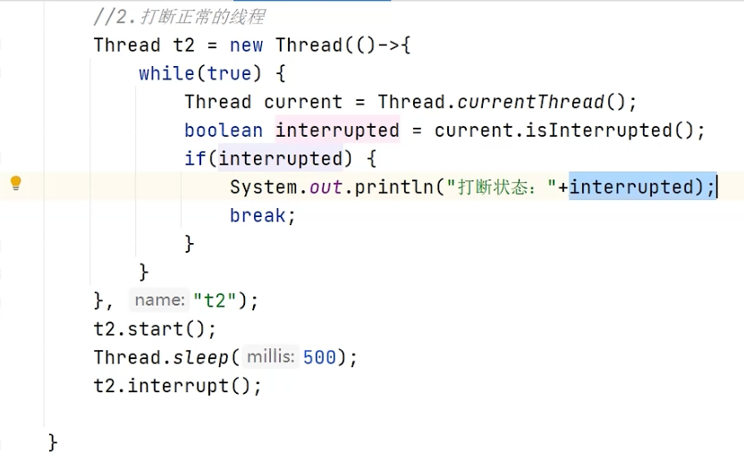

# 多线程

## 基础知识

1. 线程和进程的区别？
    - 进程：当一个程序被运行，从磁盘加载这个程序的代码到内存中，就开启了一个进程
    - 线程：指令流，按照指令顺序交给cpu执行
    - 对比：
      - 进程是正在运行程序的实例，包含了线程，每个线程执行不同的任务
      - **不同进程使用不同内存空间，同一进程内的线程共享内存空间**
      - 线程切换上下文比进程切换耗费资源小，更快
2. 并行与并发的区别？
   - 单核cpu
     - 多时间片，cpu轮流执行
     - 微观串行，宏观并行
     - 并发：线程轮流使用cpu的做法
   - **多核cpu**
     - 同一时间片，可以有多个核心分别运行多个线程，互不影响
     - 并发：同一时间内应对多个事情的能力，多个线程轮流使用一个或多个cpu（交替）
     - 并行：同一时间内，同时处理多个事情的能力，4核cpu同时运行4个线程（同时）
     - 类比：
        - 并发：一个保姆要做饭、洗碗、看孩子，轮流交替做这些事情
        - 并发和并行：保姆和家人同时做这些事情，会有竞争，一口锅，等待
        - 并发：三个保姆，分别专职做这三件事情，互不干扰
3. 创建线程的方式有哪些？
   1. 继承thread类
   2. 实现runnable接口
   3. 实现callable接口
   4. 线程池创建线程  
4. callable和runnable区别
   - callable有返回值，是个泛形，配合funtask、future获取异步执行的结果
   - runnale没有返回值
   - callable能抛异常，runable不能只能内部消化try catch
5. start和run区别？
     1. start用来启动线程，运行run中代码逻辑，只能调用一次
     2. run封装了线程运行逻辑，可以调用多次
6. 线程包含哪些状态？状态之间如何变化？
   1. 新建new
   2. 可执行状态runnale
   3. 终结terminated
   4. 阻塞blocked
   5. 等待waiting
   6. 计时等待time waiting
7. 线程之间状态转换关系
   1. 
   2. 转换：
      1. 创建线程对象是新建状态
      2. 调用了start方法后是可执行状态
      3. 线程获取了cpu执行权，执行结束后是终止状态
      4. 在可执行状态下，可转换成其他状态
         1. 未获取到锁阻塞状态，获取锁后变为可执行
         2. 调用wait方法等待状态，其他线程调用notify后，变为可执行
         3. 调用sleep（50）方法，会是计时等待状态，时间到后变为可执行状态  
8. notify和notifyall区别？
   1. notify随机唤醒一个线程
   2. notifyall唤醒所有线程
   3. 代码：两个线程公用同一个lock锁，如何lock.wait（），最终lock.notify（）
9. 如何保证t1,t2,t3线程的顺序执行？
   1. 使用join方法，t2线程中调用t1.join（），代表t1运行完成后，t2才能运行
10. wait和sleep方法区别？
    1. 共同点：都是线程让出cpu使用权，进入阻塞状态
    2. 不同点：
        1. 方法归属不同：
           1. wait（）和wait（long）方法是object的成员方法，每个对象都有
           2. sleep是Thread类的静态方法
        2. 醒来时机不同：
           1. wait（long）和sleep（long）都会等待相应毫秒后醒来
           2. wait可以被notify提前唤醒，若不设置等待时间而且不手动唤醒，永远等待
           3. 都可以被打断唤醒
        3. 锁机制不同：
           1. wait必须中同步快或同步代码中调用，调用前必须获取对象的监视器锁，sleep无限制
           2. wait方法执行会释放对象锁，允许其他线程获取锁
           3. sleep若曾synchronized代码块中，不会释放锁
11. 如何停止一个正在运行的线程？
    1. 使用退出标志，线程正常退出，比如定义while（flag），修改flag的值
    2. stop强行终止（不推荐已作废）
    3. iterrupt方法中断线程
         1. 打断阻塞线程（sleep、wait、join），线程抛interrruptedExcption异常
         2. 打断正常线程，根据打断状态来标记是否退出线程
            1. 

## 并发安全

1. synchronized的原理？
   1. synchronized【对象锁】采用互斥方式同时最只有一个线程持有对象锁
   2. javap -v xx.class查看字节码信息
   3. 底层锁monitor实现，nonitor是jvm级别的对象（c++实现），线程获取锁需要使用对象（锁）关联monitor
   4. monitor内部有三个属性
      1. owner关联的是获取锁的线程，并且只能关联一个线程
      2. entrylist关联的锁阻塞线程
      3. waitset关联处于waitting的线程
   5. 非公平锁
2. monitor实现的锁死重量级锁，呢了解过锁升级吗？（todo）
   1. synchronized有偏向锁、轻量锁、重量级锁三种状态，分别对应锁只被一个线程持有、不同线程交替持有锁、多线程竞争锁的三种情况
   2. 偏向锁：一段很长时间内都只被一个线程使用锁，可以使用偏向锁，第一次获取锁时，会有一个cas操作，之后线程再获取锁，只需要判断对象头的mark word中是否有自己的线程id即可，而不是开销较大的cas命令
   3. 轻量级锁：线程加锁的时间是错开的（没有竞争），使用轻量级锁优化。轻量级锁修改了对象头的锁标志，比重量级性能高。每次修改都是cas操作，保证原子性
   4. 重量级锁：底层使用monitor实现，里面涉及用户态和内核态的切换、进程的上下文切换、成本高、性能差
3. 谈谈jmm（java内存模型）？
   1. jmm定义了共享内存中多线程程序的读写操作的行为规范，通过规则规范内存读写操作，保持指令正确性
   2. jmm吧内存分为两块，私有线程的工作区域（内存），所有线程的共享区域（内存）
   3. 线程之间相互隔离，线程之间交互通过主内存
4. cas知道吗？
   1. 全称：compare and sawp（比较再交换），体现乐观锁思想，在无锁状态下保证操作数据的原子性
   2. 使用：aqs框架、atomicxxx类、retreenlock
   3. 操作共享变量的时候使用自旋锁，效率高
   4. cas底层是调用uasafe类的方法，是操作系统提供，其他语言实现
5. 乐观锁与悲观锁？
   1. cas是乐观锁思想：乐观估计，不担心别的线程修改共享变量，修改了也没关系，吃点亏在再重试呗
   2. synchronized基于悲观锁思想：悲观估计，防着其他线程修改共享变量，上锁后别的线程别想改，我改为再解锁，你们才有机会
   3. 
6. 谈谈对volatile关键字对理解？
   1. 保证线程之间的可见性
      1. 用volatile修饰共享变量，防止jit编译器等优化的发生，让一个线程对共享变量的修改对另一个线程可见
      2. 例子：while（stop）因为执行次数太多，编译器优化成while（true）
   2. 禁止指令重排序
      1. 指令重排：修饰共享变量会在读、写共享变量时加入不同的屏障，防止其他读写操作越过屏障，从而达到指令重排序效果。
7. 什么是aqs
   1. 抽象队列同步器，多线程的一种锁机制，是构建锁或其它同步组件的基本框架，reentrantlock阻塞式锁、semaphore信号量、countdownlatch倒计时锁
   2. aqs中维护了一个先进先出的双向队列，存储的死排队的线程
   3. aqs内部维护了一个属性state，相当于资源，默认是0（无锁状态），队列中有一个线程修改成功了state为1，则当前线程获取了资源
   4. state修改的时候使用的是cas操作，保证多个线程修改情况下的原子性
   5. 
8. reentantlock的实现原理？
   1. 可重用锁，表示重新进入的锁，调用lock方法获取锁之后，再次调用lock，不会再阻塞
   2. reentantlock利用cas+aqs队列实现
   3. 支持公平和非公平锁，无参默认非公平，也可传参数（true）设置成公平锁
   4. 
9. synchronized和lock的区别？
   1. 语法
      1. sysnchroized是关键字，源码在jvm，c++实现
      2. lock是接口，jdk提供，java实现
      3. **syschroized，退出同步代码块锁会自动释放，lock需要手动调用unlock方法**
   2. 功能
      1. 同属悲观锁、都具有互斥、同步、锁重入功能
      2. lock有syschroized不具备功能，例如公平锁、可打断、可超时、多条件变量
      3. lock有适合不同场景的实现，入retreenlock，reentrantreadwritelock(读写锁)
   3. 性能
      1. 没有竞争时，synchronized有优化，如偏向锁、轻量级锁、性能好
      2. 有竞争时，lock性能更好
10. 死锁产生条件
    1. 一个线程需要同时获取多把锁，容易发生死锁
11. 如何进行死锁诊断？
    1. 当出现死锁现象，可以用jps和jstack查看
    2. jps输出jvm中运行的线程状态信息
    3. jstack查看线程堆栈信息，查看日志是否存在死锁，若有结合代码分析
    4. 可视化工具jconsle（基于jmx的gui性能监控工具）
    5. 可视化工具visualvm可以检查死锁（故障处理工具）
12. concurrenthashmap  
    1. 底层数据结构
       1. jdk1.7底层采用分段的数组 + 链表实现
       2. jdk1.8底层和hashmap1.8的结构一样，数据+链表/红黑二叉树
    2. 加锁方式
       1. jdk1.7时segment分段锁，底层使用的锁reentrantlock
       2. jdk1.8采用cas添加新节点，采用synchronized锁定链表或红黑树的首节点，比segment分段锁粒度更细，性能更好  

## 线程池

1. 线程池核心参数
   1. corepoolsize 核心线程数
   2. maximumpoolsize 最大线程数目 = 核心线程数 + 救急线程最大数目
   3. keepalivetime 生存时间 救急线程的的生存时间，生存时间内没有新任务，此线程资源会释放
   4. unit 时间单位 救急线程的生存时间单位，秒 毫秒等
   5. workqueen 当没有空闲核心线程时，新来任务会加入到此队列排队，队列满后会创建救急线程执行任务
   6. threadfactory 线程工厂 可以定制线程对象的创建，例如线程名字、是否守护线程等
   7. handler 拒绝策略 当所有线程都在繁忙，workqueue也满时，会出发点拒绝策略
2. 线程池执行原理
   1. 
   2. 
   3. callerrunspolicy是调用主线程去执行最新添加的这一个任务，队列中的不管了
   4. discardolderstpolicy丢弃最靠前的任务
      1.   
3. 线程池阻塞队列有哪些
   1. 
   2. 
4. 如何确定核心线程数
   1. io密集型：文件读写、db读写、网络请求  核心线程= 2n + 1 （n为cpu核数 逻辑处理器数目）
   2. cpu密集型：计算型代码，biemap转换、gson转换  核心线程 = n + 1  
   3. 高并发、任务执行时间短   cpu核数 + 1 减少线程上下文切换
   4. 并发不高、任务执行时间长
      1. io密集 2n+1
      2. cpu密集 n+1
   5. 并发高、业务执行时间长，不在于线程池在于整体架构设计，是否能用缓存做第一步，增加服务器做第二步，线程池设置参考上述
5. 线程池种类有哪些
   1. newfixedthreadpool：创建一个定长线程池，可控制线程最大并发数，超出线程在队列中等待（适用于任务量已知，任务耗时）
   2. newsinglethreadexecutor:创建一个单线程化的线程池，核心线程数1，只会用唯一工作线程执行任务，保证任务按照指定顺序fifo执行（适用于按照顺序执行任务）
   3. newcachethreadpool：创建可缓存线程池，核心线程数0，若线程池长度超过处理需要，可灵活回收空闲线程，若无可回收，则创建新线程（任务数密集，任务执行时间短，不然会创建大量线程，占用内存）
   4. newsheduledthreadpool：可执行延迟任务的线程池，支持定时以及周期性任务执行
   5. 注：newfixedthreadpool、newsinglethreadexecutor核心线程 最大线程数量一样
6. 不建议使用executors创建线程池
   1. fiedthreadpool和singlethreadpool：
      1. 允许的请求队列长度数integer.max_value，可能堆积大量请求oom
   2. cachedthreadpool：
      1. 允许创建最大线程数量integer.max_value，可能堆积线程oom  

## 使用场景

1. his服务器配置
   1. intel 至强 sliver 4216 cpu 16核心 32线程/ 4208 8核心 16线程
   2. 内存 64g
   3. 主 从 结构  
2. 场景一：
   1. 病区拆分时候使用多线程提高速度
   2. 33个个核心线程 最大400 队列1
3. 场景二：
   1. 将1000万数据导入es索引库中，避免oom
   2. 技术点：
      1. countdownlatch（闭锁/倒计时锁），等待所有线程完成倒计时（一个或多个线程等待其他多个线程完成某件事情后才能执行）
      2. 构造参数用来初始化等待计数值
      3. await（）用来等待计数归零
      4. countdown（）用来让等待计数减1
   3. 流程：
      1. 查询出总条数
      2. 每页2000条，计数出总页数
      3. 分页查询数据
      4. for 循环：
         1. 查询当前页文章
         2. 创建线程任务批量导入es，contdownloatch（）计数减一
            1. 线程任务run方法中，调用bulkrequest批量导入对象，指定索引库名称，发送rest请求批量添加数据到es中，contdownloatch（）计数减一
         3. 提交线程池执行
      5. 代码部分：
         1. 
         2. 
      6. 主线程countdown.await()
   4. 服务器配置 4208 8核心 16线程
   5. 线程池参数设置
      1. 核心线程 17
      2. 最大线程 50
      3. 队列长度1000
      4. 存活时间 500ms
      5. 阻塞队列linkedblockingqueue
   6. 
   7. 为什么要让主线程等待？
4. 场景三：数据汇总
   1. 订单500ms、商品800ms、物流500ms 分为三个微服务互相等待耗时，共1800ms
   2. 调用多接口开发时，若接口之间无依赖关系，用线程池 + futrue提升性能
   3. 报表汇总 图文发布数量、点赞数量、收藏数量、评论数量
   4. 多个futrue<Map<string, obj>>>excutorserver.submit（rest请求）
   5. futrue.get（）获取结果后，汇总返回
5. 场景四：异步调用
   1. 医生经常搜索的药品，把用户的搜索历史记录记下来
   2. 线程池开一个异步线程
      1. 在方法上加上注解@async（"taskexcutor"/线程池的名字）
      2. springboot引导类上加上注解@enableAsync开启异步调用
   3. 避免下一次影响上一级方法，提高性能
