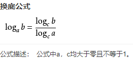

# 什么是对数logN

## 什么是对数
软件开发中通过合理的算法能减小计算的空间复杂度和时间复杂度，有的复杂度为logN，什么是logN？通过毕业后的努力工作基本都忘了。

## 对数
首先，logN被称为对数，是在幂函数的基础上衍生的。例如：3²=9，可以得到log以3为底的9的对数等于2，可以理解为3相乘等于9，这里是两个3相乘，所以结果就是2。

比较经典的二分查找法的时间复杂度就是O(logN)（以2为底），若是用迭代的方式时间复杂度是O（N），N是数据量的个数；我们可以假设若是个数有100个，每一次查询的时间用1毫秒，二分查找法最坏需要查询7毫秒，用迭代法最坏需要100毫秒。若是10亿次呢？二分查找法最坏只需要30毫秒，迭代法最坏需要277多个小时，这样一比较，高下立判，还是算法好。

平时开发中设计算法的时候大多是需要和业务强相关的场景，其他的例如排序和查找都已经有合适的工具类了，为了更好的应用指导算法原理是大有裨益的。

附一张《算法图解》中的截图。

电脑中计算机求对数
电脑中只有log（以10为底）和ln（以e为底）
  
根据换地公式计算：求以2为底8的对数，可以log8%log2=3
